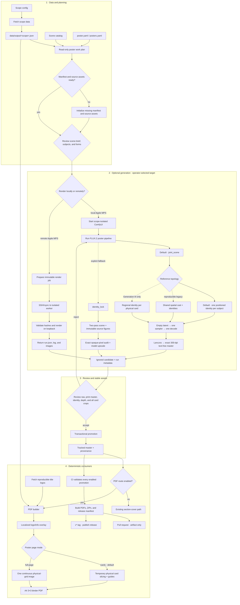

# Poster Artwork Workflow

This is the operator guide for creating, reviewing, promoting, and consuming a
scope poster. The detailed implementation rationale lives in
[POSTER_ARTWORK_CONCEPT.md](POSTER_ARTWORK_CONCEPT.md); tracked requirements and
future work live in
[POSTER_ARTWORK_REQUIREMENTS.md](POSTER_ARTWORK_REQUIREMENTS.md).
The optional, non-production paired edit-training path is documented separately
in [POSTER_ARTWORK_TRAINING.md](POSTER_ARTWORK_TRAINING.md).

## Lifecycle at a glance



Data fetching and PDF rendering never start ComfyUI implicitly. Poster
generation is an explicit post-fetch step because it is GPU-intensive,
probabilistic, and subject to a visual promotion gate. A promoted poster is
generated once and then reused deterministically for every supported language.
Aggregate indexes fan out to independent section manifests before generation
and join again only when the PDF page collection is assembled.

The normal PDF order is `promoted poster → card pages`. The poster contains the
cover's semantic copy and replaces that cover. A section without an enabled
promoted poster keeps the established `section cover → card pages` path. The
same fallback is selected explicitly by `--skip-poster`.

CI uses the same boundary. Pull requests run a complete, read-only release
rehearsal that validates promoted posters and builds every PDF, ZIP, and the
release manifest without publishing a GitHub Release. Before PDF rendering,
CI downloads configured title logos into the ignored poster source cache; it
does not regenerate artwork or download cutouts. Tagged releases reuse that
candidate build and publish only after it succeeds. See
[Release Workflow](RELEASE_WORKFLOW.md).

## Resolve the workspace render target before GPU work

Starting poster generation requires a configured workspace target. An agent
first reads the active poster workspace's ignored `renderer.local.yaml`. The
default marker is `tmp/poster-workspaces/renderer.local.yaml`; custom combined
workspaces keep it below `$BINDER_POKEDEX_POSTER_ASSETS`. A
complete local or remote marker remains valid for that workspace and does not
require another question. The agent asks only when a new workspace has no
marker, required values are missing, the configured worker cannot be reached,
or the operator requests a change. Conversation history, unrelated SSH state,
or a reachable ComfyUI process alone is not a workspace configuration.

- **Local:** use the scope-isolated launcher and runner documented below. Keep
  ComfyUI on loopback and keep generated candidates below ignored workspace
  paths.
- **Remote:** prepare an immutable, hash-pinned render job and follow
  [Remote Poster Render Worker](POSTER_RENDER_WORKER.md). The remote worker
  validates the ComfyUI commit, model hashes, workflow, inputs, MPS device, and
  job-specific input directory before queueing.

When remote rendering is selected but the marker is incomplete, an assisting
agent may ask for these non-secret connection parameters:

1. an existing SSH config alias;
2. the disposable remote runtime root;
3. the persistent remote model-cache root;
4. the disposable remote job root;
5. the remote repository checkout path.

The operator remains responsible for establishing SSH authentication and for
confirming that the approved models are present. Real hostnames, IP addresses,
usernames, and machine-specific paths may be recorded only in the ignored
workspace marker or private SSH configuration, never in tracked files, render
jobs, provenance, or reports. Credentials and private keys do not belong in
the marker. Remote ComfyUI stays bound to remote loopback; jobs
are queued on the worker rather than through a publicly exposed API.

## Required and optional phases

| Phase | Required for a normal PDF | Required for a poster PDF | May be repeated |
| --- | --- | --- | --- |
| Fetch scope data | yes | yes | whenever source data changes |
| Inspect poster work plan | no | recommended | after fetch/configuration changes |
| Initialize poster scope | no | yes | only when configuration changes |
| Generate ComfyUI candidate | no | yes | until a candidate passes review |
| Promote candidate | no | yes | once per accepted revision |
| Enable `pdf.enabled` | no | yes | configuration choice |
| Build PDF | yes | yes | as needed |
| `--poster-page-mode full-page` | no | optional continuous-page output | as needed |
| `--skip-poster` | optional | bypasses poster use | as needed |

## 1. Fetch the scope

```bash
python scripts/fetcher/fetch.py --scope SV04
```

The fetcher writes `data/output/SV04.json`. It does not create or regenerate a
poster. Featured cover imagery and poster-generation subjects are deliberately
separate:

- `featured_elements.image_url` remains the TCG card or cover image;
- `featured_elements.poster_subject` identifies the exact transparent PokeAPI
  Official Artwork used for the poster;
- the subject records the National-Dex species, concrete base/form artwork ID,
  canonical allowlisted URL, and stable key.

This distinction matters for Mega, Primal, Charizard X/Y, and other forms whose
artwork ID differs from the species ID. Older checked-in ExGen/ME output is
resolved deterministically through the featured `card_id` and its source card.
A form-marked card without exact Official Artwork is an error; the workflow
never substitutes base-species art silently.

Form IDs are checked offline against
`config/pokeapi_form_species.json`, which is pinned to one PokeAPI source
commit. When PokeAPI adds a new species or form, update that registry from
`data/v2/csv/pokemon.csv` and review the mapping before the new subject can
enter a poster run.

## 2. Inspect the read-only work plan

After a fetch, ask the planner what actually changed before downloading assets
or starting ComfyUI:

```bash
python scripts/poster_assets/poster_work_plan.py --scope SV04
python scripts/poster_assets/poster_work_plan.py --scope Pokedex
python scripts/poster_assets/poster_work_plan.py \
  --scope Pokedex/sections/gen3
python scripts/poster_assets/poster_work_plan.py \
  --all-configured \
  --json
```

The planner performs no downloads, writes, GPU work, promotion, or routing
changes. It resolves aggregate routing and compares source data, scene briefs,
cutout selection and pixels, logos, model contracts, effective prompts,
semantic generation fingerprints, overlay fingerprints, and promoted outputs.
Its stable states distinguish missing configuration/assets, readiness to
generate, stale generation, invalid promotion, reviewed-but-disabled promotion,
and a current enabled promotion. Overlay drift is reported with the cheap
`refresh_promoted_overlay` action; it never recommends ComfyUI for text, logo,
translation, panel-design, or `pdf.enabled` changes.

Apply that cheap action directly from the stable promoted artwork and its
embedded generation run:

```bash
python scripts/poster_assets/promote_comfyui_poster.py \
  --scope Pokedex/sections/gen3 \
  --artwork assets/posters/Pokedex/sections/gen3/poster-flux2-artwork.png \
  --run-metadata assets/posters/Pokedex/sections/gen3/poster-flux2-provenance.json \
  --name flux2 \
  --force
```

Using promoted provenance as `--run-metadata` is an overlay-only refresh. It
revalidates the unchanged generation inputs against their recorded supported
graph contract, then rebuilds the localized preview, card slices, overlay
fingerprint, and output hashes without starting ComfyUI.

Legacy promotions can be upgraded while their original full-manifest,
cutout-hash, output, and regenerated-overlay checks still pass:

```bash
python scripts/poster_assets/migrate_poster_provenance.py --scope Base1
python scripts/poster_assets/migrate_poster_provenance.py --all-enabled
```

Migration adds only semantic provenance metadata. It neither regenerates the
text-free artwork nor changes promoted preview/card files, and it refuses
ambiguous legacy drift instead of guessing. The migration infers only audited
reference topologies and records their historical graph contract; it never
relabels a v1/v2 run as current v3. Such a reviewed promotion remains usable,
while the planner reports the optional `upgrade_generation_pipeline` action.

## 3. Initialize poster configuration and source assets

Initialize one individual TCG set after its data has been fetched:

```bash
python scripts/poster_assets/init_poster_scope.py \
  --scope SV04 \
  --layout standard_3x3 \
  --fetch
```

`standard_3x3` is the default and should normally be omitted. The initializer:

- creates the reviewed FLUX.2 `joint_scene` contract;
- embeds the set-specific creative brief from `config/posters/scenes.yaml`;
- derives a stable per-scope seed;
- selects the canonical featured Pokémon for the bottom row (three for the
  normal 3×3 case, or fewer only when the source section defines fewer);
- keeps different visual forms of one species as distinct poster subjects;
- configures available localized logos;
- fetches exact transparent source cutouts and logos with `--fetch`;
- leaves `pdf.enabled` false until an artwork is reviewed.

After fetching all scopes, every still-missing individual TCG poster manifest
can be prepared in one explicit batch:

```bash
python scripts/poster_assets/init_poster_scope.py \
  --all-tcg-sets \
  --fetch
```

The batch command never overwrites an existing reviewed manifest.

For an existing checkout, reproducible sources can be refreshed independently:

```bash
# Everything required to prepare a new artwork candidate
python scripts/poster_assets/fetch_poster_sources.py \
  --scope SV04

# Only the downloaded overlays needed by PDF generation
python scripts/poster_assets/fetch_poster_sources.py \
  --scope SV04 \
  --kind logos
```

Both commands write only below `tmp/poster-workspaces/<asset-key>/sources/`.
They never change the promoted master or provenance.

Aggregate scopes use an ordered routing index plus one isolated leaf manifest
per section. Initialize all configured Pokédex generation bundles after its
data fetch with:

```bash
python scripts/poster_assets/init_poster_scope.py \
  --scope Pokedex \
  --all-sections \
  --fetch
```

This keeps `config/posters/Pokedex/posters.yaml` separate from the nine
generation manifests below `Pokedex/sections/`. New bindings begin disabled;
reviewed bindings can then be enabled independently. Each has its own seed and
provenance boundary and selects only that generation's three starter
`featured_elements`. Adding or promoting one generation therefore does not
invalidate another generation's generation fingerprint. Other aggregate scopes
use the same structure: `ExGen1`, `ExGen2`, and `ExGen3` are checked in. All 15
current aggregate sections have scene briefs and leaf manifests. Their PDF
bindings remain disabled until each generated scene is reviewed and promoted.

ExGen3 uses the same aggregate lifecycle for its `normal` and `mega` sections:

```bash
python scripts/fetcher/fetch.py --scope ExGen3
python scripts/poster_assets/init_poster_scope.py \
  --scope ExGen3 \
  --all-sections \
  --fetch
python scripts/poster_assets/poster_work_plan.py --scope ExGen3
```

Ordered casts are declared as `section_featured_card_ids` in the scope
configuration. ExGen3 selects Koraidon, Pikachu, and Miraidon for its normal
section and Mega Latias, Mega Diancie, and Mega Lucario for its Mega section.
ExGen2 keeps its reviewed Mega cast at Mewtwo X, Rayquaza, and Latios while
still retaining Mewtwo Y as a separate card and form in the section. A
configured card ID that is missing, duplicated, ambiguous, or assigned to an
unknown section is a hard fetch error. This keeps source updates deterministic
instead of silently changing a reviewed composition.

Form-specific cutout filenames include both species and Official Artwork ID.
The cutout manifest, read-only planner, promotion validator, and generation
fingerprint all verify the same identity. Changing Mega X to Mega Y therefore
requires new cutouts and artwork even though the National-Dex species is
unchanged. Ordinary base-form manifests and fingerprints remain compatible
with already promoted posters. The runner and promotion fingerprint boundary
also reject stale source/cutout selections, so skipping the planner cannot
turn a form back into its base species.

## 4. Review the creative brief

Review `config/posters/<scope>/poster.yaml` for an individual set, or the
selected aggregate leaf such as
`config/posters/Pokedex/sections/gen1/poster.yaml`, especially:

- `artwork.scene`;
- the selected cutouts;
- text-cell locations;
- the generation model, seed, and output settings.

Every current individual TCG set has an explicit seed brief in
`config/posters/scenes.yaml`. The initializer copies that brief into the
manifest. The final production prompt is then generated from four inputs:

1. the set-specific creative scene;
2. scope name, series, and release metadata;
3. the configured card layout and text-safe cells;
4. one central identity, placement, depth, and continuous-ground contract.

This avoids tracked, duplicated full prompts drifting apart. The generated
prompt snapshot is written to the scope's ignored `comfyui_poster/` workspace
when the candidate is prepared. No full prompt is maintained per scope by hand.

## 5. Start local ComfyUI

```bash
scripts/poster_assets/start_comfyui_poster.sh --scope SV04
```

The project launcher applies the required Apple Metal/MPS compatibility patch
and binds the selected scope's isolated input, output, and temporary
directories.

For one aggregate section, pass its stable asset key:

```bash
scripts/poster_assets/start_comfyui_poster.sh \
  --scope Pokedex/sections/gen1
```

## 6. Generate a candidate

```bash
python scripts/poster_assets/run_comfyui_poster.py --scope SV04
```

The corresponding aggregate command is:

```bash
python scripts/poster_assets/run_comfyui_poster.py \
  --scope Pokedex/sections/gen1
```

For ExGen3, generate each isolated section independently:

```bash
python scripts/poster_assets/run_comfyui_poster.py \
  --scope ExGen3/sections/normal
python scripts/poster_assets/run_comfyui_poster.py \
  --scope ExGen3/sections/mega
```

The production runner reads the FLUX.2 model, reference topology, sampling
contract, seed, generation size, and output contract from the scope's
`poster.yaml`.

The configured model also selects its required guider graph without creating a
second poster pipeline. Klein models retain the reviewed CFG-1 graph with
positive and negative reference chains. A `flux2_dev` model uses the official
Dev profile with guidance 4, positive references, and `BasicGuider`; its step
count remains explicit in `artwork.generation.steps`.

The default `individual_spatial_joint` path:

1. derives each target silhouette rectangle from the shared physical layout
   and cutout alpha bounds, then writes its normalized canvas coordinates into
   the one-shot prompt;
2. supplies one neutral 0.5-MP poster-shaped reference per subject, containing
   exactly that subject at its final pose, scale, baseline, and card-safe
   coordinates;
3. uses that same named reference as the subject's identity, anatomy,
   silhouette, color, and marking authority;
4. starts from one `EmptyFlux2LatentImage`, invents the complete landscape and
   all characters together, and samples exactly once;
5. treats every known subject bound plus clearance as an invisible no-crossing
   volume for camera-near scenery, while continuing the same natural low ground
   plane through it;
6. decodes and saves that result directly, with no character
   composite, mask repair, or source-pixel restoration afterwards.

The scene brief controls camera, terrain, atmosphere, palette, and broad
composition. The normalized rectangles request position, size, baseline,
visible padding, and card-safe regions. The model synthesizes landscape and
Pokémon together. It is instructed to keep tall or camera-near scenery outside
the character volumes instead of solving a foreground crossing, while still
generating coherent ground contact, shadows, reflected light, and depth. A
visible clearing or a changed body part, face, marking, defining contour,
scale, or placement remains a hard visual rejection. Preparation writes
`individual_spatial_reference_1.png` through the current subject count and
`individual_spatial_joint_prompt.generated.txt`. It does not produce a shared
cast, unscaled identity detail views, inpaint references, masks, scene plates,
or references for rejected experiments.

The accepted `spatial_identity_joint` v5 topology remains reproducible for its
five promoted scopes. It instead uses one shared 0.5-MP cast for placement plus
one unscaled 512 px identity reference per subject. Select it only to reproduce
or deliberately revise one of those existing contracts:

```bash
python scripts/poster_assets/run_comfyui_poster.py \
  --scope <scope> \
  --flux-mode joint_scene \
  --flux-reference-mode spatial_identity_joint
```

The cast-free `regional_identity_joint` topology remains available to
reproduce or diagnose the reviewed Generation III promotion:

```bash
python scripts/poster_assets/run_comfyui_poster.py \
  --scope Pokedex/sections/gen3 \
  --flux-mode joint_scene \
  --flux-reference-mode regional_identity_joint
```

It keeps the same empty target, one sampler, one decode, and deterministic
print output, but replaces the cast with sampler-level regional conditioning:

1. a reference-free default branch establishes the set-specific landscape in
   every pixel not covered by a regional branch;
2. each subject gets one local branch with exactly its own 512 px identity
   reference;
3. each branch is constrained to its complete physical bottom-card cell via
   `ConditioningSetAreaPercentage`;
4. the local branch generates the character, nearby terrain, shadow,
   vegetation, and occlusion together during the same sampling trajectory.

No box, mask, silhouette, or layout guide is supplied as image content, and
there is still no later character insertion or repair. Preparation writes only
`identity_reference_*.png` plus
`joint_scene_regional_identity_prompt.generated.txt`; it does not write
`joint_scene_cast_reference.png`.

The override creates a local diagnostic candidate and does not change the
active manifest or promoted poster. Existing promotions remain reproducible.
Do not use this override for a new promotion or mechanical migration. The 2026-07-30
representative audit rerendered all six spatial-v5 promotions and approved
none of their regional-v6 candidates. Complete-card regional conditioning can
replace the global landscape prediction inside the lower row and produce
separate horizons or card scenes. Generation III was a reviewed historical
exception before its v9 replacement; no active promotion now uses regional
conditioning. New scopes use avoidance-first individual-spatial v9 or the
explicit identity-lock fallback.
Reopening regional work requires a materially different control mechanism and
an explicit new decision; repeated seed, prompt, or regional-strength sweeps
are outside the accepted stop rule.

The retained graph has no hard three-subject limit, but only its historical
standard-3x3 Generation III result was reviewed. Wide layouts remain
unapproved.

Because `joint_scene` deliberately redraws all pixels, an opaque-source-pixel
equality audit is not applicable. Its hard gates are a complete generation
fingerprint and explicit visual review of both the actual raw file and the
deterministically scaled text-free print artwork, plus all physical card crops.
New approvals require `--reviewer-kind human` or `--reviewer-kind agent`;
agent inspection must never be recorded as human approval. All 42 enabled
poster bundles have passed that gate: 38 with avoidance-first individual-spatial v9,
`ExGen2/sections/primal` with its reviewed `landscape_first_v1` prompt profile
on the same individual-spatial graph, and `SV04.5`, `ME05`, and `SV08` with
their reviewed mask-free spatial-identity v7 contracts.
Candidate-specific seeds, hashes, and rejected bounded tests remain recorded
in the status and experiment log.

`identity_lock` remains an explicit fallback when a scope cannot pass the
one-shot identity or placement review:

```bash
python scripts/poster_assets/run_comfyui_poster.py \
  --scope <scope> \
  --flux-mode identity_lock
```

The fallback still creates its own scene, places the exact reviewed source
figures, verifies every fully opaque source pixel, and model-upscales to the
same 300-dpi print geometry. A manifest describes one active generation
contract at a time. Switch and promote a fallback deliberately; do not maintain
two competing active promotions for one scope. No active promoted scope
currently uses the fallback.

The override above creates a fallback candidate but does not silently change
the active manifest. The command prints the candidate and matching run-metadata
paths. After accepting the result:

1. copy the complete `generation` object from that `.run.json` into
   `artwork.generation` in the scope's `poster.yaml`, including all model
   hashes, `upscale_model`, `upscale_model_sha256`, `output_dpi: 300`, and
   `output_method: model_upscale`;
2. run the planner and require a promotable/currently matching contract;
3. promote the IL candidate without `--approve-joint-scene`.

```bash
python scripts/poster_assets/poster_work_plan.py --scope <scope>

python scripts/poster_assets/promote_comfyui_poster.py \
  --scope <scope> \
  --artwork <model-upscaled-text-free-artwork.png> \
  --run-metadata <matching.run.json> \
  --name flux2
```

Promotion rejects IL previews, missing upscaler hashes, and any contract other
than the reviewed 300-dpi model-upscale path. All candidates, references,
workflows, and run metadata remain ignored local workspace files until an
accepted result is promoted.

## 7. Review and promote

Review all of the following before promotion:

- complete text-free artwork;
- raw ComfyUI artwork before any resize;
- all bottom-row card crops;
- character identity, anatomy, colors, pose, scale, and padding;
- grounding and scenery at every silhouette boundary;
- logo and localized information overlay;
- absence of landing pads, paths, generated text, boxes, or extra creatures.

Promote only an accepted candidate:

```bash
python scripts/poster_assets/promote_comfyui_poster.py \
  --scope SV04 \
  --artwork <printed-text-free-artwork.png> \
  --run-metadata <matching.run.json> \
  --name flux2 \
  --approve-joint-scene --reviewer-kind human

python scripts/poster_assets/validate_promoted_poster.py --scope SV04
```

For an aggregate target, use the same asset key for promotion and validation,
for example `Pokedex/sections/gen1`.

Promotion is transactional and versions only the text-free master plus its
provenance. Localized previews, physical crops, downloaded cutouts, and title
logos live below `tmp/`. The audit records hashes for models, prompts, source
figures, references, workflows, and the durable master. Exact-source modes require a
passed `exact_opaque_source_pixels` record; changing the manifest engine or
supplying otherwise matching hashes cannot bypass that gate.

A `joint_scene` candidate follows a separate fail-closed review contract. Its
run must contain the complete current generation fingerprint, exact source
identity records, raw-artwork hashes, and deterministic text-free print hashes.
After comparing both artifacts and every subject crop with the reviewed
cutouts, the `--approve-joint-scene` flag and explicit reviewer kind above record a timestamped approval
bound to those exact pixels and source
identities; it is not a generic bypass. Promotion still rejects a candidate
whose recorded generation contract differs from `poster.yaml`. Generation VII
`00018` is the first reviewed promotion using this contract.

## 8. Enable and consume the poster

After promotion, review and enable the manifest:

```yaml
pdf:
  enabled: true
  artwork_file: poster-flux2-artwork.png
  insertion: after_first_section_cover
```

For an aggregate scope, enable the matching binding in the root
`posters.yaml` instead. Its leaf manifest remains the immutable generation and
provenance boundary:

```yaml
- id: gen1
  section_id: gen1
  manifest: sections/gen1/poster.yaml
  pdf:
    enabled: true
    artwork_file: poster-flux2-artwork.png
    insertion: after_section_cover
```

The persisted `insertion` values identify the first or matching section for
backward-compatible routing. Once selected, the enabled poster replaces that
section's cover; it is no longer emitted as an additional page after it.

After fetching scope data, download any configured title-logo overlays and
then consume the promoted local artwork:

```bash
python scripts/poster_assets/fetch_poster_sources.py \
  --scope SV04 \
  --kind logos
python scripts/pdf/generate_pdf.py --scope SV04 --language de
```

The PDF step adds the exact localized logo/information. Its default `cards`
mode slices the result and embeds all crops at physical card size. A single
scope poster replaces the first section cover; aggregate posters replace their
respective configured section covers. The step does not contact ComfyUI or
regenerate the background.

All semantic copy comes from `data/output/<scope>.json`; `poster.yaml` only
selects its layout and rendering contract. The deterministic information block
depends on the target type:

| Target | Top cell | Middle information cell | Footer |
| --- | --- | --- | --- |
| Individual TCG set | Localized full set logo, otherwise the source set name | Set name when the top is a logo; card count; localized release label; release date | `Binder Pokedex` |
| Pokédex section | Source collection name `Pokédex` | Localized generation title, region, Pokémon count, Pokédex range | `Binder Pokedex` |
| Other aggregate section | Localized source section title, including one inferred trailing token logo when supported | Subtitle, representative Pokémon count, description/date range | `Binder Pokedex` |

These rows mirror the semantic cover information. The representative Pokémon
are already part of the jointly generated scene. The cover's cutting hint and
build timestamp are operational footer metadata and are intentionally absent
from poster-first PDFs. Fallback covers use the same scope type to label TCG-set
totals as cards and Pokédex/variant totals as Pokémon.

To keep an enabled 3×3 poster whole, without card gaps or cutting guides:

```bash
python scripts/pdf/generate_pdf.py \
  --scope SV04 \
  --language de \
  --poster-page-mode full-page
```

The localized poster is drawn once at its exact 200.5 × 276.7 mm physical grid
size and centered on A4. The distinct output suffix is
`_POSTER_FULL_PAGE.pdf`, so it cannot overwrite the default cuttable build.
The mode changes only presentation: it uses the same promoted text-free master
and the same deterministic localized overlay.

To bypass the poster for one isolated build:

```bash
python scripts/pdf/generate_pdf.py \
  --scope SV04 \
  --language de \
  --skip-poster
```

The output receives a `_NO_POSTER.pdf` suffix.

`--skip-poster` and `--poster-page-mode full-page` are intentionally mutually
exclusive: once poster discovery is bypassed, the section cover is the only
introductory page and no poster presentation mode applies.

## Local custom layouts without release-asset changes

Custom layouts use an isolated poster-assets root below ignored `tmp/`. This
keeps the checked-in 3×3 manifests, promoted artwork, release validation, and
release PDFs unchanged. For a German Pokédex pilot that replaces only the
Generation-I cover with a 4×3 artwork:

```bash
python scripts/poster_assets/create_custom_poster_layout.py \
  --scope Pokedex \
  --section gen1 \
  --layout wide_4x3 \
  --fallback-pokemon 25 \
  --include-unselected-promotions

export BINDER_POKEDEX_POSTER_ASSETS="$PWD/tmp/custom-poster-layouts/pokedex-gen1-wide_4x3"

python scripts/poster_assets/fetch_cutouts.py \
  --scope Pokedex/sections/gen1

scripts/poster_assets/start_comfyui_poster.sh \
  --scope Pokedex/sections/gen1
python scripts/poster_assets/run_comfyui_poster.py \
  --scope Pokedex/sections/gen1 \
  --language de
```

Review the printed text-free artwork path and run-metadata path reported by the
runner. Promote that reviewed candidate into the isolated workspace, never the
tracked asset root:

```bash
python scripts/poster_assets/promote_comfyui_poster.py \
  --scope Pokedex/sections/gen1 \
  --artwork <reported-text-free-artwork.png> \
  --run-metadata <reported-run-metadata.json> \
  --language de \
  --name flux2 \
  --approve-joint-scene --reviewer-kind human

python scripts/pdf/generate_pdf.py \
  --scope Pokedex \
  --language de
```

By default, the custom workspace enables only the selected aggregate bindings,
so all other Pokédex generations retain their ordinary section covers. The
explicit `--include-unselected-promotions` option instead copies the other
already promoted bundles into the ignored workspace. This keeps every existing
artwork page in a hybrid PDF without symlinking or modifying tracked release
assets. Omit `--section gen1` to prepare all nine generation workspaces; each
leaf still needs its own generated, reviewed, and locally promoted artwork
before the PDF can be built. Unset `BINDER_POKEDEX_POSTER_ASSETS` to return
every command to the tracked production assets.

To prepare a complete 4×3 Pokédex workspace, assign the additional fourth
Pokémon explicitly per generation instead of reusing one fallback across every
section:

```bash
python scripts/poster_assets/create_custom_poster_layout.py \
  --scope Pokedex \
  --layout wide_4x3 \
  --section-fallback-pokemon gen1=25 \
  --section-fallback-pokemon gen2=175 \
  --section-fallback-pokemon gen3=280 \
  --section-fallback-pokemon gen4=447 \
  --section-fallback-pokemon gen5=570 \
  --section-fallback-pokemon gen6=700 \
  --section-fallback-pokemon gen7=778 \
  --section-fallback-pokemon gen8=831 \
  --section-fallback-pokemon gen9=921
```

This creates nine independent 4×3 manifests. Every leaf requires its own
generated, reviewed, and locally promoted 4×3 artwork. Once all nine promotions
exist, the cuttable German PDF emits two A4 pages per generation: source
columns 1–3 on the first page and source column 4 in the first column of the
second page. Pokémon card pages remain unchanged.

## Layout policy

| Layout | Subjects | Physical grid | Cuttable PDF | Continuous full page |
| --- | ---: | --- | --- | --- |
| `standard_2x2` | 2; the first two curated subjects when shrinking an existing layout | 132 × 182.8 mm | upper-left four slots of one A4 portrait page; right column and bottom row stay empty | A4 portrait |
| `standard_3x3` | 3 by default; 1–2 only when the source section has fewer canonical subjects | 200.5 × 276.7 mm | one A4 portrait page | A4 portrait |
| `wide_4x3` | exactly 4 | 269 × 276.7 mm | two A4 portrait pages: left 3 columns + right column | A3 landscape |
| `wide_4x4` | up to 4 | 269 × 370.6 mm | two A4 portrait pages: 9 + 7 cards | A3 portrait |

The artwork, placement, prompt, upscale, promotion, validation, and slicing
layers understand all four layouts. A 2×2 artwork places its title in row 1,
column 1, its information panel in row 1, column 2, and its two subjects in the
bottom row. A 4×3 artwork reserves all four bottom cards for subjects;
expanding a 3×3 source therefore requires one explicit `--fallback-pokemon`.
The 4×3 custom workspace positions the title at row 2, column 2 and the
information panel beside it at row 2, column 3.

The cuttable PDF renderer keeps the standard 3×3 A4 grid. A 2×2 poster retains
its shape in slots 1, 2, 4, and 5, leaving the other five slots empty. For a
4×3 poster, page one contains source columns 1–3 in their original 3×3
arrangement. Page two contains source column 4 vertically in its first column,
with its remaining six fields empty. The two sheets can therefore be placed
side by side without reordering any crop, and no card is scaled down.
`full-page` remains a literal continuous-sheet mode, so wide layouts still
require their indicated A3 orientation there.

Every raster cell is derived from cumulative physical start and end positions,
not from repeatedly adding independently rounded card and gap widths. Generation
references use both dimensions of the real latent-aligned canvas; finalization,
slicing, promotion, and validation reconstruct the same exact per-cell bounds
from the image itself. At small resolutions, adjacent cards may intentionally
differ by one pixel. At 300 dpi, all layouts retain exact 750 × 1050 card
crops. New runs bind these dimensions and bounds to raster geometry contract v2
inside their engine-specific generation fingerprint.

## Adding a new individual TCG set

Before initializing the new scope:

1. add its regular fetch configuration;
2. fetch its generated `data/output/<scope>.json`;
3. add one explicit creative brief to `config/posters/scenes.yaml`;
4. run the tests, which require exact catalog coverage with no missing or stale
   TCG-set entries;
5. follow the lifecycle above.

No Pokemon names, layout contract, or identity rules should be added to
model-specific Python code.
