# Panorama-Review – deine Freigaberunde

Stand: 14.09.2026. Diese Übersicht ist ein dateigebundener Review-Snapshot, kein neuer Release-Status.

**Nachtrag zur erneuten Sichtung:** Die aktuelle [Arbeitsplanung und Neubewertung aller 40 offenen Ziele](2026-09-14-panorama-next-steps.md) unterscheidet 36 One-Shot-Empfehlungen, drei Kandidaten zur direkten Nutzerbewertung und einen unklaren Detailfall. Die [nächste überschaubare Freigaberunde](2026-09-14-panorama-shortlist.md) zeigt die drei Kandidaten sowie Relaxo/Evoli als getrennte Restentscheidungen. Die historischen Befunde und bisherigen menschlichen Entscheidungen unten bleiben erhalten; es wurden keine Bilder ersetzt oder neue Freigaben erteilt.

## Was ist noch offen?

Von 42 Motiven sind zwei neue One-Shot-Kandidaten von dir visuell akzeptiert: **ExGen3 Mega C** und **Basis-Set B**. Ihre technische Übernahme und die PDF-Prüfung stehen separat aus.

Die folgenden **40 Bestandsfassungen** sind zur Bewertung zusammengestellt. 39 wurden im bisherigen Agentencheck beanstandet; ME05 hat auch die unabhängige Zweitprüfung bestanden. Es handelt sich nicht um 40 neu erzeugte Fassungen der zuletzt akzeptierten One-Shot-Rezeptur. Für P02 ist nach drei verworfenen und zwei weiteren lokalen Versuchen jetzt **Pikachu samt korrigierter Vordergrundüberdeckung in Fassung E visuell akzeptiert**: [Kartenausschnitt, Quelle und Freigabe](2026-09-14-base2-contour-repair.md). Das ist eine Teilfreigabe; Relaxo, Evoli und das vollständige Panorama bleiben offen. Die Bestandsfassung wurde nicht ersetzt.

Die alten Prüfurteile sind Hinweise, keine vorweggenommene Entscheidung von dir. Einige entstanden vor der ausdrücklichen Klarstellung zur erwünschten Vordergrundüberdeckung. Ein landschaftlich passender Grashalm oder Stein vor einem Pokémon ist allein kein Fehler. Unverdeckte anatomische Abweichungen bleiben eigene Prüfpunkte.

## So bewertest du

Antworte im Chat einfach mit Kennung und Entscheidung, etwa `P01: korrigieren – Hopplos Gesicht` oder `P03: passt`. Möglich sind **passt**, **korrigieren** und **neu generieren**. Ergänze bei Bedarf, welche kleinen Abweichungen du ausdrücklich akzeptierst. Unkommentierte Motive bleiben offen.

- Erkennbarkeit und Quelltreue: Gesicht, Augen, Ohren, Gliedmaßen, Farben und prägende Merkmale.
- Natürliche Einbindung: passende Beleuchtung, Bodenkontakt und plausible Vordergrundüberdeckung.
- Gesamteindruck und Kartenausschnitte: nichts störend angeschnitten, keine zusätzlichen Figuren.

Deine Entscheidung bezieht sich auf das konkrete Artwork, nicht automatisch auf Logos, Beschriftungen, PDF-Druckqualität oder die komplette Veröffentlichung. Angezeigt werden die textfreien Master. Die verlinkten physischen Ausschnitte können bereits deterministische Beschriftungen enthalten.

Für jedes freizugebende Pokémon stehen ab jetzt der **exakte Kartenausschnitt links** und das **tatsächlich verwendete Quellbild rechts** direkt nebeneinander, beschriftet mit Name/Form und Kartenposition. Das Gesamtpanorama ergänzt diesen Vergleich. Die Bilder behalten ihr Seitenverhältnis; die Links unter jedem Paar öffnen die Originalauflösung. Es handelt sich um die zu dieser Bestandsfassung belegten Quellen, nicht um neu ausgetauschte Referenzen.

## Bereits visuell akzeptiert – nicht erneut offen

- ExGen3 Mega C: [akzeptiertes Bild](../../tmp/oneshot-trials/exgen3-source-detail-20260914-c/review/artwork-300dpi.png) · [Freigabenachweis](2026-09-14-exgen3-oneshot-c.json). Noch nicht technisch übernommen.
- Basis-Set B: [akzeptiertes Bild](../../tmp/oneshot-trials/base1-source-detail-20260914-b/review/artwork-300dpi.png) · [Freigabenachweis](2026-09-14-base1-oneshot.json). Noch nicht technisch übernommen.

## Vollständige Übersicht

| Kennung | Motiv / Ziel | Bisheriger Agentencheck | Bild |
| --- | --- | --- | --- |
| P01 | Stellarkrone (SV07) | 3 Figur(en) beanstandet | [Master öffnen](../../assets/posters/SV07/poster-flux2-artwork.png) |
| P02 | Dschungel (Base2) | 1 Figur(en) beanstandet, 2 unklar | [Master öffnen](../../assets/posters/Base2/poster-flux2-artwork.png) |
| P03 | Dunkelnacht (ME05) | Agentencheck bestanden | [Master öffnen](../../assets/posters/ME05/poster-flux2-artwork.png) |
| P04 | Pokédex – Generation I (Pokedex/sections/gen1) | 2 Figur(en) beanstandet | [Master öffnen](../../assets/posters/Pokedex/sections/gen1/poster-flux2-artwork.png) |
| P05 | Pokédex – Generation II (Pokedex/sections/gen2) | 2 Figur(en) beanstandet, 1 unklar | [Master öffnen](../../assets/posters/Pokedex/sections/gen2/poster-flux2-artwork.png) |
| P06 | Pokédex – Generation III (Pokedex/sections/gen3) | 2 Figur(en) beanstandet | [Master öffnen](../../assets/posters/Pokedex/sections/gen3/poster-flux2-artwork.png) |
| P07 | Pokédex – Generation IV (Pokedex/sections/gen4) | 1 Figur(en) beanstandet | [Master öffnen](../../assets/posters/Pokedex/sections/gen4/poster-flux2-artwork.png) |
| P08 | Pokédex – Generation V (Pokedex/sections/gen5) | 2 Figur(en) beanstandet | [Master öffnen](../../assets/posters/Pokedex/sections/gen5/poster-flux2-artwork.png) |
| P09 | Pokédex – Generation VI (Pokedex/sections/gen6) | 1 Figur(en) beanstandet, 1 unklar | [Master öffnen](../../assets/posters/Pokedex/sections/gen6/poster-flux2-artwork.png) |
| P10 | Pokédex – Generation VII (Pokedex/sections/gen7) | 1 Figur(en) beanstandet | [Master öffnen](../../assets/posters/Pokedex/sections/gen7/poster-flux2-artwork.png) |
| P11 | Pokédex – Generation VIII (Pokedex/sections/gen8) | 2 Figur(en) beanstandet, 1 unklar | [Master öffnen](../../assets/posters/Pokedex/sections/gen8/poster-flux2-artwork.png) |
| P12 | Pokédex – Generation IX (Pokedex/sections/gen9) | 2 Figur(en) beanstandet | [Master öffnen](../../assets/posters/Pokedex/sections/gen9/poster-flux2-artwork.png) |
| P13 | Pokémon ex - Generation 1 (ExGen1/sections/normal) | 2 Figur(en) beanstandet | [Master öffnen](../../assets/posters/ExGen1/sections/normal/poster-flux2-artwork.png) |
| P14 | Pokémon EX (ExGen2/sections/normal) | 3 Figur(en) beanstandet | [Master öffnen](../../assets/posters/ExGen2/sections/normal/poster-flux2-artwork.png) |
| P15 | Mega-Pokémon EX (ExGen2/sections/mega) | 3 Figur(en) beanstandet | [Master öffnen](../../assets/posters/ExGen2/sections/mega/poster-flux2-artwork.png) |
| P16 | Primal Pokémon EX (ExGen2/sections/primal) | 2 Figur(en) beanstandet | [Master öffnen](../../assets/posters/ExGen2/sections/primal/poster-flux2-artwork.png) |
| P17 | Fossil (Base3) | 2 Figur(en) beanstandet, 1 unklar | [Master öffnen](../../assets/posters/Base3/poster-flux2-artwork.png) |
| P18 | Karmesin & Purpur (SV01) | 1 Figur(en) beanstandet, 1 unklar | [Master öffnen](../../assets/posters/SV01/poster-flux2-artwork.png) |
| P19 | Entwicklungen in Paldea (SV02) | 2 Figur(en) beanstandet, 1 unklar | [Master öffnen](../../assets/posters/SV02/poster-flux2-artwork.png) |
| P20 | Obsidian Flammen (SV03) | 2 Figur(en) beanstandet | [Master öffnen](../../assets/posters/SV03/poster-flux2-artwork.png) |
| P21 | 151 (SV03.5) | 2 Figur(en) beanstandet, 1 unklar | [Master öffnen](../../assets/posters/SV03.5/poster-flux2-artwork.png) |
| P22 | Paradoxrift (SV04) | 3 Figur(en) beanstandet | [Master öffnen](../../assets/posters/SV04/poster-flux2-artwork.png) |
| P23 | Paldeas Schicksale (SV04.5) | 1 Figur(en) beanstandet, 1 unklar | [Master öffnen](../../assets/posters/SV04.5/poster-flux2-artwork.png) |
| P24 | Gewalten der Zeit (SV05) | 2 Figur(en) beanstandet, 1 unklar | [Master öffnen](../../assets/posters/SV05/poster-flux2-artwork.png) |
| P25 | Maskerade im Zwielicht (SV06) | 1 Figur(en) beanstandet, 1 unklar | [Master öffnen](../../assets/posters/SV06/poster-flux2-artwork.png) |
| P26 | Nebel der Sagen (SV06.5) | 2 Figur(en) beanstandet, 1 unklar | [Master öffnen](../../assets/posters/SV06.5/poster-flux2-artwork.png) |
| P27 | Stürmische Funken (SV08) | 1 Figur(en) beanstandet, 1 unklar | [Master öffnen](../../assets/posters/SV08/poster-flux2-artwork.png) |
| P28 | Prismatische Entwicklungen (SV08.5) | 2 Figur(en) beanstandet | [Master öffnen](../../assets/posters/SV08.5/poster-flux2-artwork.png) |
| P29 | Reisegefährten (SV09) | 2 Figur(en) beanstandet, 1 unklar | [Master öffnen](../../assets/posters/SV09/poster-flux2-artwork.png) |
| P30 | Ewige Rivalen (SV10) | 3 Figur(en) beanstandet | [Master öffnen](../../assets/posters/SV10/poster-flux2-artwork.png) |
| P31 | Schwarze Blitze (SV10.5B) | 2 Figur(en) beanstandet | [Master öffnen](../../assets/posters/SV10.5B/poster-flux2-artwork.png) |
| P32 | Weiße Flammen (SV10.5W) | 3 Figur(en) beanstandet | [Master öffnen](../../assets/posters/SV10.5W/poster-flux2-artwork.png) |
| P33 | SVP Black Star Promos (SVP) | 3 Figur(en) beanstandet | [Master öffnen](../../assets/posters/SVP/poster-flux2-artwork.png) |
| P34 | Mega-Entwicklung (ME01) | 2 Figur(en) beanstandet, 1 unklar | [Master öffnen](../../assets/posters/ME01/poster-flux2-artwork.png) |
| P35 | Fatale Flammen (ME02) | 3 Figur(en) beanstandet | [Master öffnen](../../assets/posters/ME02/poster-flux2-artwork.png) |
| P36 | Erhabene Helden (ME02.5) | 3 Figur(en) beanstandet | [Master öffnen](../../assets/posters/ME02.5/poster-flux2-artwork.png) |
| P37 | Optimale Ordnung (ME03) | 1 Figur(en) beanstandet | [Master öffnen](../../assets/posters/ME03/poster-flux2-artwork.png) |
| P38 | Wachsendes Chaos (ME04) | 3 Figur(en) beanstandet | [Master öffnen](../../assets/posters/ME04/poster-flux2-artwork.png) |
| P39 | MEP Black Star Promos (MEP) | 3 Figur(en) beanstandet | [Master öffnen](../../assets/posters/MEP/poster-flux2-artwork.png) |
| P40 | Pokémon ex (ExGen3/sections/normal) | 2 Figur(en) beanstandet, 1 unklar | [Master öffnen](../../assets/posters/ExGen3/sections/normal/poster-flux2-artwork.png) |

## Bilder und Quellen

Die Reihenfolge beginnt mit Stellarkrone, Dschungel und Dunkelnacht. Danach folgen die übrigen Motive. Noch keines dieser 40 Panoramen ist vollständig vom Nutzer akzeptiert. Bei P02 sind Pikachu und die zwei korrigierten Vordergrundhalme in Fassung E akzeptiert; die technische Übernahme steht aus. Relaxo und Evoli sind weiterhin offen.

### P01 – Stellarkrone (SV07)

**Deine Bewertung: offen.** 3 Figur(en) beanstandet.

Zwei Ohren sind vorhanden. Offene Prüfpunkte: Hopplos linkes Auge/Nasenbereich, Zahn und Farbflächen; außerdem Krallen-/Pfotenabweichungen bei Bisasam und Schiggy.

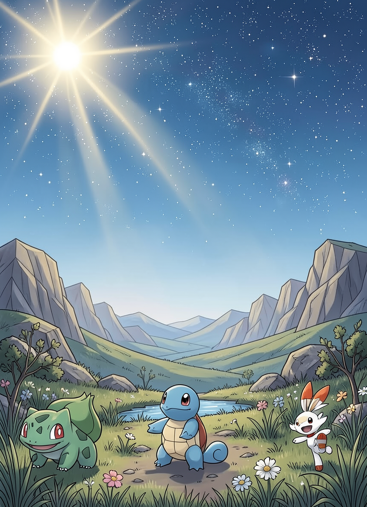

#### P01 – Bisasam · unten links

Bisheriger Agentencheck: beanstandet. Deine Bewertung: offen.

| Kartenausschnitt | Quell-Pokémon |
| --- | --- |
|  |  |

[Zuschnitt in Originalauflösung](../../tmp/poster-workspaces/SV07/comfyui_poster/promotion/poster-flux2-cards/card_r3_c1.png) · [Quellbild in Originalauflösung](../../tmp/poster-workspaces/SV07/sources/cutouts/pokemon_001_bulbasaur.png)

#### P01 – Schiggy · unten Mitte

Bisheriger Agentencheck: beanstandet. Deine Bewertung: offen.

| Kartenausschnitt | Quell-Pokémon |
| --- | --- |
|  |  |

[Zuschnitt in Originalauflösung](../../tmp/poster-workspaces/SV07/comfyui_poster/promotion/poster-flux2-cards/card_r3_c2.png) · [Quellbild in Originalauflösung](../../tmp/poster-workspaces/SV07/sources/cutouts/pokemon_007_squirtle.png)

#### P01 – Hopplo · unten rechts

Bisheriger Agentencheck: beanstandet. Deine Bewertung: offen.

| Kartenausschnitt | Quell-Pokémon |
| --- | --- |
|  |  |

[Zuschnitt in Originalauflösung](../../tmp/poster-workspaces/SV07/comfyui_poster/promotion/poster-flux2-cards/card_r3_c3.png) · [Quellbild in Originalauflösung](../../tmp/poster-workspaces/SV07/sources/cutouts/pokemon_813_scorbunny.png)

[Vorhandene Fassung mit Beschriftung](../../tmp/poster-workspaces/SV07/comfyui_poster/promotion/poster-flux2.png) · [Prüfbericht](2026-09-12-panorama-audit-early-tcg.json)

Bildkennung: `876c1c23d1bd31ee` (vollständiger Hash im zugehörigen JSON-Snapshot).

### P02 – Dschungel (Base2)

**Deine Bewertung: teilweise visuell freigegeben.** Pikachu samt Überdeckung durch zwei Vordergrundhalme in Fassung E ist akzeptiert; die technische Übernahme steht aus. Relaxo und Evoli sind noch offen. Der historische Agentencheck (1 Figur beanstandet, 2 unklar) bleibt als vorheriger Befund erhalten.

Noch zu prüfen sind unter anderem Relaxos Mundlinie/Zähne und Evolis zusätzliche rötliche Wangenfläche. Pikachus bisherige Detailabweichungen wurden in der gezeigten Fassung vom Nutzer akzeptiert. Die zwei von ganz unten/vorn kommenden Halme laufen in der akzeptierten Fassung E vor Pikachus ausgestrecktem Arm beziehungsweise linker Bauchseite weiter. Ein korrekt vor dem Körper verlaufendes Blatt ist ausdrücklich erwünscht. Das folgende Gesamtbild zeigt weiterhin die unveränderte Bestandsfassung, nicht E.

#### P02 – Pikachu · unten links

Bisheriger Agentencheck der Bestandsfassung: unklar. **Deine Bewertung: Pikachus Darstellung und Tiefenkorrektur an zwei Halmen in E akzeptiert.**

Nutzerfeedback vom 14.09.2026: „pikachu an sich passt prima. die 2 halme laufen aber wie gehabt nicht vor ihm lang, obwohl sie das aus dieser pespektive sollten“

[Markierte Korrekturstellen](../../tmp/panorama-review-inputs/2026-09-14/p02-pikachu-foreground-guide.png). Orange Linien sind nur Markierungen. Die drei ersten Nacharbeitsversuche A–C waren nicht erfolgreich. Die anschließend konturgeführte Fassung E zeigt beide Halme vor Pikachu; nur deren zwei schmale Regionen sind verändert. **E wurde am 14.09.2026 mit „das sieht prima aus!“ für Pikachu samt Halmen akzeptiert:** [akzeptierter Kartenausschnitt direkt neben der Quelle und Freigabenachweis](2026-09-14-base2-contour-repair.md). Die kleine Konturunregelmäßigkeit am Bauchhalm war vor dieser Bewertung offengelegt. Das Bildpaar unten bleibt als unveränderte Bestandsfassung erhalten. Keine vollständige Panorama- oder Release-Freigabe.

| Kartenausschnitt | Quell-Pokémon |
| --- | --- |
|  |  |

[Zuschnitt in Originalauflösung](../../tmp/poster-workspaces/Base2/comfyui_poster/promotion/poster-flux2-cards/card_r3_c1.png) · [Quellbild in Originalauflösung](../../tmp/poster-workspaces/Base2/sources/cutouts/pokemon_025_pikachu.png)

#### P02 – Relaxo · unten Mitte

Bisheriger Agentencheck: beanstandet. Deine Bewertung: offen.

| Kartenausschnitt | Quell-Pokémon |
| --- | --- |
|  |  |

[Zuschnitt in Originalauflösung](../../tmp/poster-workspaces/Base2/comfyui_poster/promotion/poster-flux2-cards/card_r3_c2.png) · [Quellbild in Originalauflösung](../../tmp/poster-workspaces/Base2/sources/cutouts/pokemon_143_snorlax.png)

#### P02 – Evoli · unten rechts

Bisheriger Agentencheck: unklar. Deine Bewertung: offen.

| Kartenausschnitt | Quell-Pokémon |
| --- | --- |
|  |  |

[Zuschnitt in Originalauflösung](../../tmp/poster-workspaces/Base2/comfyui_poster/promotion/poster-flux2-cards/card_r3_c3.png) · [Quellbild in Originalauflösung](../../tmp/poster-workspaces/Base2/sources/cutouts/pokemon_133_eevee.png)

[Vorhandene Fassung mit Beschriftung](../../tmp/poster-workspaces/Base2/comfyui_poster/promotion/poster-flux2.png) · [Prüfbericht](2026-09-12-panorama-audit-early-tcg.json)

Bildkennung: `9c0c166cc6bda2f8` (vollständiger Hash im zugehörigen JSON-Snapshot).

### P03 – Dunkelnacht (ME05)

**Deine Bewertung: offen.** Agentencheck bestanden.

Im bisherigen Agentencheck einschließlich unabhängiger Zweitprüfung bestanden. Hier ist insbesondere dein eigener Gesamteindruck gefragt; das ist noch keine PDF- oder Release-Freigabe.

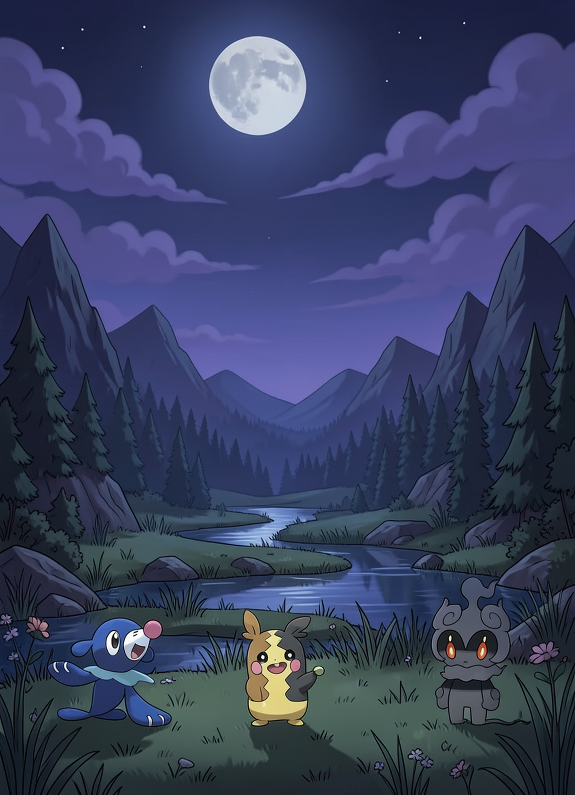

#### P03 – Robball · unten links

Bisheriger Agentencheck: bestanden. Deine Bewertung: offen.

| Kartenausschnitt | Quell-Pokémon |
| --- | --- |
|  |  |

[Zuschnitt in Originalauflösung](../../tmp/poster-workspaces/ME05/comfyui_poster/promotion/poster-flux2-cards/card_r3_c1.png) · [Quellbild in Originalauflösung](../../tmp/poster-workspaces/ME05/sources/cutouts/pokemon_728_popplio.png)

#### P03 – Morpeko · unten Mitte

Bisheriger Agentencheck: bestanden. Deine Bewertung: offen.

| Kartenausschnitt | Quell-Pokémon |
| --- | --- |
|  |  |

[Zuschnitt in Originalauflösung](../../tmp/poster-workspaces/ME05/comfyui_poster/promotion/poster-flux2-cards/card_r3_c2.png) · [Quellbild in Originalauflösung](../../tmp/poster-workspaces/ME05/sources/cutouts/pokemon_877_morpeko.png)

#### P03 – Marshadow · unten rechts

Bisheriger Agentencheck: bestanden. Deine Bewertung: offen.

| Kartenausschnitt | Quell-Pokémon |
| --- | --- |
|  |  |

[Zuschnitt in Originalauflösung](../../tmp/poster-workspaces/ME05/comfyui_poster/promotion/poster-flux2-cards/card_r3_c3.png) · [Quellbild in Originalauflösung](../../tmp/poster-workspaces/ME05/sources/cutouts/pokemon_802_marshadow.png)

[Vorhandene Fassung mit Beschriftung](../../tmp/poster-workspaces/ME05/comfyui_poster/promotion/poster-flux2.png) · [Prüfbericht](2026-09-12-panorama-audit-late-tcg.json) · [Zweitprüfung](2026-09-12-panorama-audit-me05-sv08-second-review.json)

Bildkennung: `3120f1f07526c80d` (vollständiger Hash im zugehörigen JSON-Snapshot).

### P04 – Pokédex – Generation I (Pokedex/sections/gen1)

**Deine Bewertung: offen.** 2 Figur(en) beanstandet.

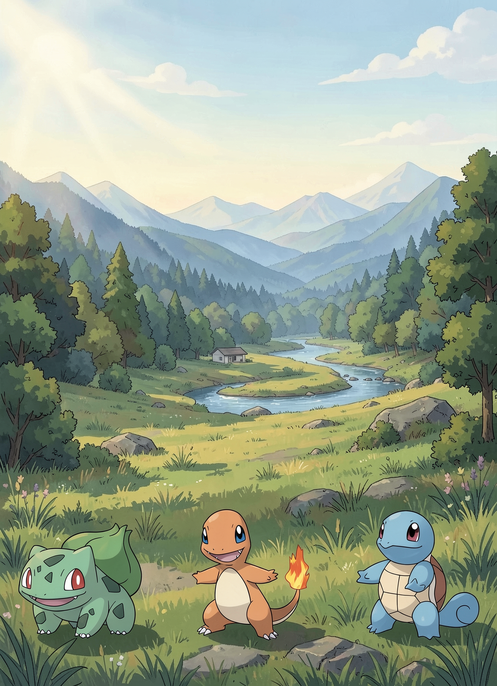

#### P04 – Bisasam · unten links

Bisheriger Agentencheck: beanstandet. Deine Bewertung: offen.

| Kartenausschnitt | Quell-Pokémon |
| --- | --- |
|  |  |

[Zuschnitt in Originalauflösung](../../tmp/panorama-audit-aggregate/Pokedex/sections/gen1/card_r3_c1.png) · [Quellbild in Originalauflösung](../../tmp/poster-workspaces/Pokedex/sections/gen1/sources/cutouts/pokemon_001_bulbasaur.png)

#### P04 – Glumanda · unten Mitte

Bisheriger Agentencheck: beanstandet. Deine Bewertung: offen.

| Kartenausschnitt | Quell-Pokémon |
| --- | --- |
|  |  |

[Zuschnitt in Originalauflösung](../../tmp/panorama-audit-aggregate/Pokedex/sections/gen1/card_r3_c2.png) · [Quellbild in Originalauflösung](../../tmp/poster-workspaces/Pokedex/sections/gen1/sources/cutouts/pokemon_004_charmander.png)

#### P04 – Schiggy · unten rechts

Bisheriger Agentencheck: bestanden. Deine Bewertung: offen.

| Kartenausschnitt | Quell-Pokémon |
| --- | --- |
|  |  |

[Zuschnitt in Originalauflösung](../../tmp/panorama-audit-aggregate/Pokedex/sections/gen1/card_r3_c3.png) · [Quellbild in Originalauflösung](../../tmp/poster-workspaces/Pokedex/sections/gen1/sources/cutouts/pokemon_007_squirtle.png)

[Prüfbericht](2026-09-12-panorama-audit-aggregate.json)

Bildkennung: `301976906809649a` (vollständiger Hash im zugehörigen JSON-Snapshot).

### P05 – Pokédex – Generation II (Pokedex/sections/gen2)

**Deine Bewertung: offen.** 2 Figur(en) beanstandet, 1 unklar.

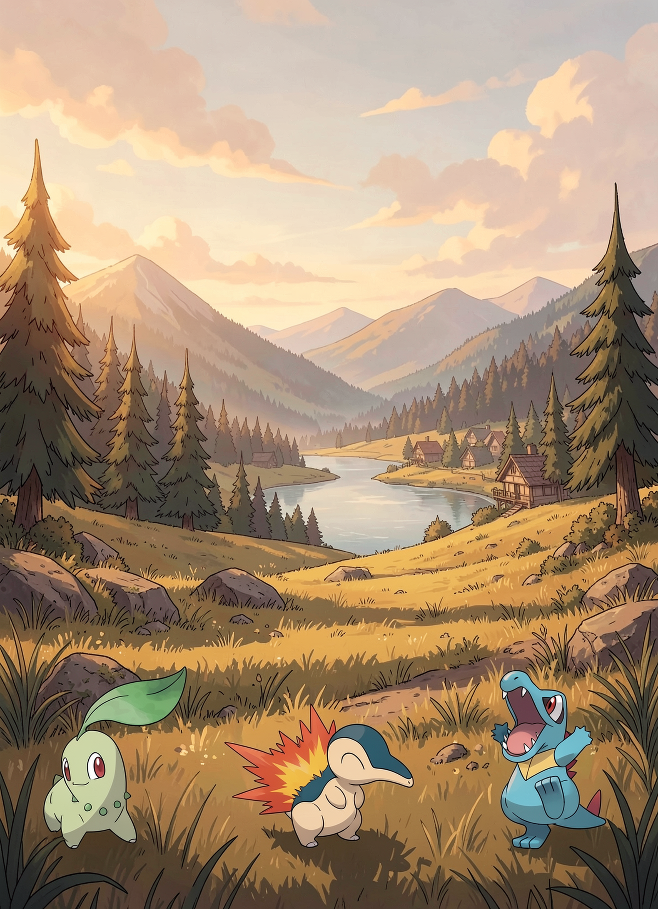

#### P05 – Endivie · unten links

Bisheriger Agentencheck: beanstandet. Deine Bewertung: offen.

| Kartenausschnitt | Quell-Pokémon |
| --- | --- |
|  |  |

[Zuschnitt in Originalauflösung](../../tmp/panorama-audit-aggregate/Pokedex/sections/gen2/card_r3_c1.png) · [Quellbild in Originalauflösung](../../tmp/poster-workspaces/Pokedex/sections/gen2/sources/cutouts/pokemon_152_chikorita.png)

#### P05 – Feurigel · unten Mitte

Bisheriger Agentencheck: beanstandet. Deine Bewertung: offen.

| Kartenausschnitt | Quell-Pokémon |
| --- | --- |
|  |  |

[Zuschnitt in Originalauflösung](../../tmp/panorama-audit-aggregate/Pokedex/sections/gen2/card_r3_c2.png) · [Quellbild in Originalauflösung](../../tmp/poster-workspaces/Pokedex/sections/gen2/sources/cutouts/pokemon_155_cyndaquil.png)

#### P05 – Karnimani · unten rechts

Bisheriger Agentencheck: unklar. Deine Bewertung: offen.

| Kartenausschnitt | Quell-Pokémon |
| --- | --- |
|  |  |

[Zuschnitt in Originalauflösung](../../tmp/panorama-audit-aggregate/Pokedex/sections/gen2/card_r3_c3.png) · [Quellbild in Originalauflösung](../../tmp/poster-workspaces/Pokedex/sections/gen2/sources/cutouts/pokemon_158_totodile.png)

[Prüfbericht](2026-09-12-panorama-audit-aggregate.json)

Bildkennung: `120df09a5614c08d` (vollständiger Hash im zugehörigen JSON-Snapshot).

### P06 – Pokédex – Generation III (Pokedex/sections/gen3)

**Deine Bewertung: offen.** 2 Figur(en) beanstandet.

#### P06 – Geckarbor · unten links

Bisheriger Agentencheck: beanstandet. Deine Bewertung: offen.

| Kartenausschnitt | Quell-Pokémon |
| --- | --- |
|  |  |

[Zuschnitt in Originalauflösung](../../tmp/panorama-audit-aggregate/Pokedex/sections/gen3/card_r3_c1.png) · [Quellbild in Originalauflösung](../../tmp/poster-workspaces/Pokedex/sections/gen3/sources/cutouts/pokemon_252_treecko.png)

#### P06 – Flemmli · unten Mitte

Bisheriger Agentencheck: bestanden. Deine Bewertung: offen.

| Kartenausschnitt | Quell-Pokémon |
| --- | --- |
|  |  |

[Zuschnitt in Originalauflösung](../../tmp/panorama-audit-aggregate/Pokedex/sections/gen3/card_r3_c2.png) · [Quellbild in Originalauflösung](../../tmp/poster-workspaces/Pokedex/sections/gen3/sources/cutouts/pokemon_255_torchic.png)

#### P06 – Hydropi · unten rechts

Bisheriger Agentencheck: beanstandet. Deine Bewertung: offen.

| Kartenausschnitt | Quell-Pokémon |
| --- | --- |
|  |  |

[Zuschnitt in Originalauflösung](../../tmp/panorama-audit-aggregate/Pokedex/sections/gen3/card_r3_c3.png) · [Quellbild in Originalauflösung](../../tmp/poster-workspaces/Pokedex/sections/gen3/sources/cutouts/pokemon_258_mudkip.png)

[Prüfbericht](2026-09-12-panorama-audit-aggregate.json)

Bildkennung: `4e05fe23e97123fb` (vollständiger Hash im zugehörigen JSON-Snapshot).

### P07 – Pokédex – Generation IV (Pokedex/sections/gen4)

**Deine Bewertung: offen.** 1 Figur(en) beanstandet.

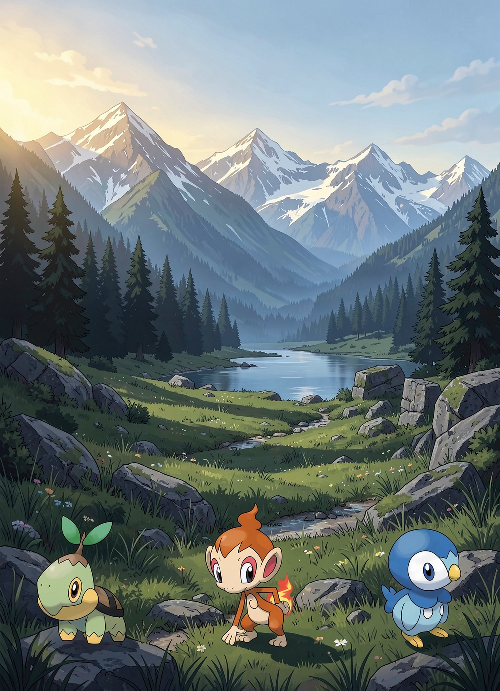

#### P07 – Chelast · unten links

Bisheriger Agentencheck: bestanden. Deine Bewertung: offen.

| Kartenausschnitt | Quell-Pokémon |
| --- | --- |
|  |  |

[Zuschnitt in Originalauflösung](../../tmp/panorama-audit-aggregate/Pokedex/sections/gen4/card_r3_c1.png) · [Quellbild in Originalauflösung](../../tmp/poster-workspaces/Pokedex/sections/gen4/sources/cutouts/pokemon_387_turtwig.png)

#### P07 – Panflam · unten Mitte

Bisheriger Agentencheck: beanstandet. Deine Bewertung: offen.

| Kartenausschnitt | Quell-Pokémon |
| --- | --- |
|  |  |

[Zuschnitt in Originalauflösung](../../tmp/panorama-audit-aggregate/Pokedex/sections/gen4/card_r3_c2.png) · [Quellbild in Originalauflösung](../../tmp/poster-workspaces/Pokedex/sections/gen4/sources/cutouts/pokemon_390_chimchar.png)

#### P07 – Plinfa · unten rechts

Bisheriger Agentencheck: bestanden. Deine Bewertung: offen.

| Kartenausschnitt | Quell-Pokémon |
| --- | --- |
|  |  |

[Zuschnitt in Originalauflösung](../../tmp/panorama-audit-aggregate/Pokedex/sections/gen4/card_r3_c3.png) · [Quellbild in Originalauflösung](../../tmp/poster-workspaces/Pokedex/sections/gen4/sources/cutouts/pokemon_393_piplup.png)

[Prüfbericht](2026-09-12-panorama-audit-aggregate.json)

Bildkennung: `1421252b2f09e23e` (vollständiger Hash im zugehörigen JSON-Snapshot).

### P08 – Pokédex – Generation V (Pokedex/sections/gen5)

**Deine Bewertung: offen.** 2 Figur(en) beanstandet.

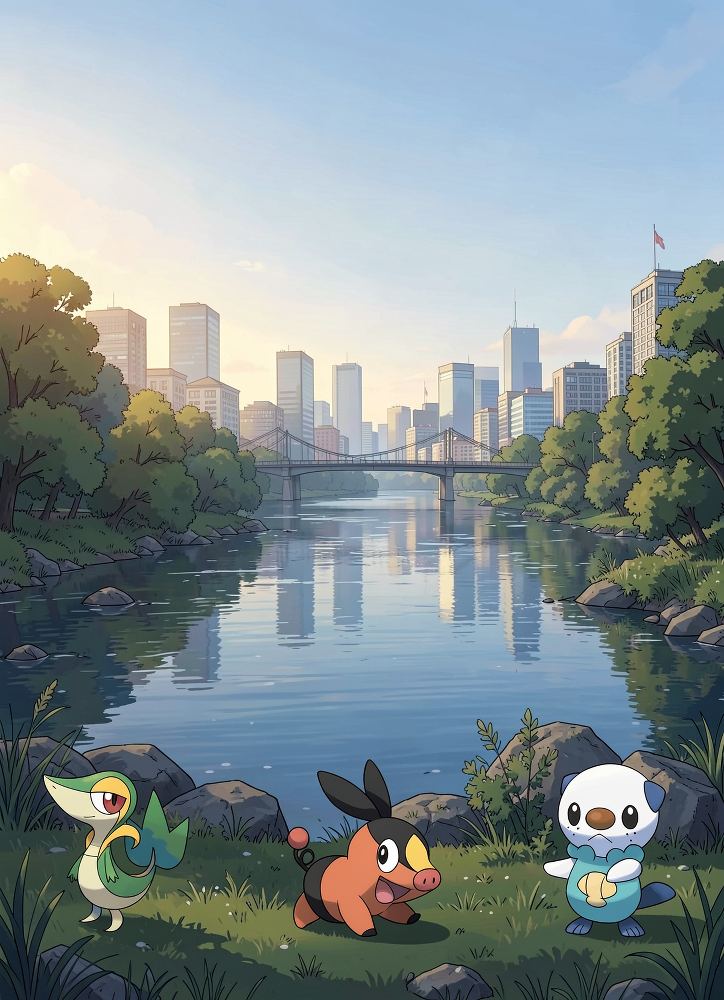

#### P08 – Serpifeu · unten links

Bisheriger Agentencheck: beanstandet. Deine Bewertung: offen.

| Kartenausschnitt | Quell-Pokémon |
| --- | --- |
|  |  |

[Zuschnitt in Originalauflösung](../../tmp/panorama-audit-aggregate/Pokedex/sections/gen5/card_r3_c1.png) · [Quellbild in Originalauflösung](../../tmp/poster-workspaces/Pokedex/sections/gen5/sources/cutouts/pokemon_495_snivy.png)

#### P08 – Floink · unten Mitte

Bisheriger Agentencheck: bestanden. Deine Bewertung: offen.

| Kartenausschnitt | Quell-Pokémon |
| --- | --- |
|  |  |

[Zuschnitt in Originalauflösung](../../tmp/panorama-audit-aggregate/Pokedex/sections/gen5/card_r3_c2.png) · [Quellbild in Originalauflösung](../../tmp/poster-workspaces/Pokedex/sections/gen5/sources/cutouts/pokemon_498_tepig.png)

#### P08 – Ottaro · unten rechts

Bisheriger Agentencheck: beanstandet. Deine Bewertung: offen.

| Kartenausschnitt | Quell-Pokémon |
| --- | --- |
|  |  |

[Zuschnitt in Originalauflösung](../../tmp/panorama-audit-aggregate/Pokedex/sections/gen5/card_r3_c3.png) · [Quellbild in Originalauflösung](../../tmp/poster-workspaces/Pokedex/sections/gen5/sources/cutouts/pokemon_501_oshawott.png)

[Prüfbericht](2026-09-12-panorama-audit-aggregate.json)

Bildkennung: `c21cc3dff19ea8b2` (vollständiger Hash im zugehörigen JSON-Snapshot).

### P09 – Pokédex – Generation VI (Pokedex/sections/gen6)

**Deine Bewertung: offen.** 1 Figur(en) beanstandet, 1 unklar.

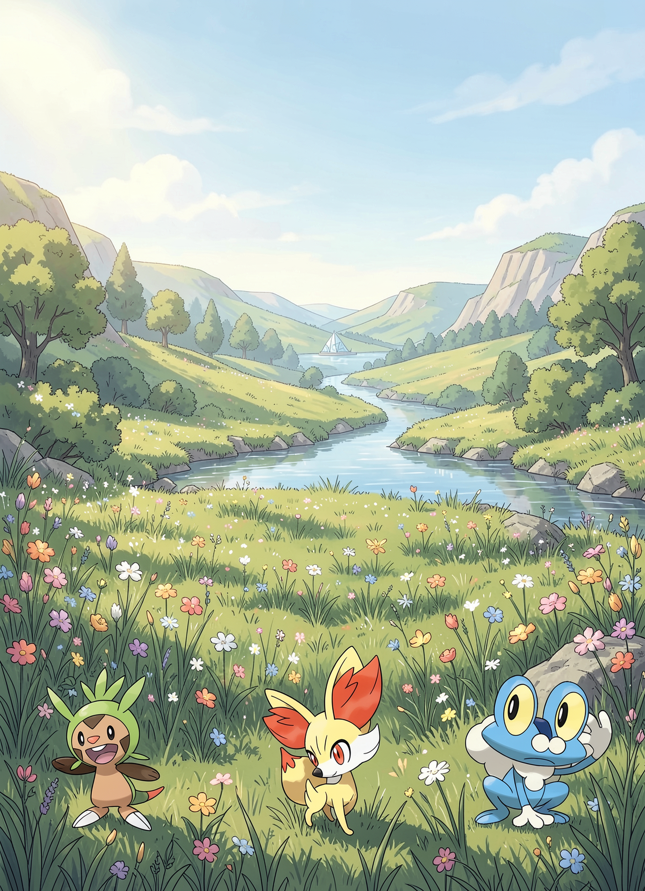

#### P09 – Igamaro · unten links

Bisheriger Agentencheck: beanstandet. Deine Bewertung: offen.

| Kartenausschnitt | Quell-Pokémon |
| --- | --- |
|  |  |

[Zuschnitt in Originalauflösung](../../tmp/panorama-audit-aggregate/Pokedex/sections/gen6/card_r3_c1.png) · [Quellbild in Originalauflösung](../../tmp/poster-workspaces/Pokedex/sections/gen6/sources/cutouts/pokemon_650_chespin.png)

#### P09 – Fynx · unten Mitte

Bisheriger Agentencheck: unklar. Deine Bewertung: offen.

| Kartenausschnitt | Quell-Pokémon |
| --- | --- |
|  |  |

[Zuschnitt in Originalauflösung](../../tmp/panorama-audit-aggregate/Pokedex/sections/gen6/card_r3_c2.png) · [Quellbild in Originalauflösung](../../tmp/poster-workspaces/Pokedex/sections/gen6/sources/cutouts/pokemon_653_fennekin.png)

#### P09 – Froxy · unten rechts

Bisheriger Agentencheck: bestanden. Deine Bewertung: offen.

| Kartenausschnitt | Quell-Pokémon |
| --- | --- |
|  |  |

[Zuschnitt in Originalauflösung](../../tmp/panorama-audit-aggregate/Pokedex/sections/gen6/card_r3_c3.png) · [Quellbild in Originalauflösung](../../tmp/poster-workspaces/Pokedex/sections/gen6/sources/cutouts/pokemon_656_froakie.png)

[Prüfbericht](2026-09-12-panorama-audit-aggregate.json)

Bildkennung: `588d433b0338783c` (vollständiger Hash im zugehörigen JSON-Snapshot).

### P10 – Pokédex – Generation VII (Pokedex/sections/gen7)

**Deine Bewertung: offen.** 1 Figur(en) beanstandet.

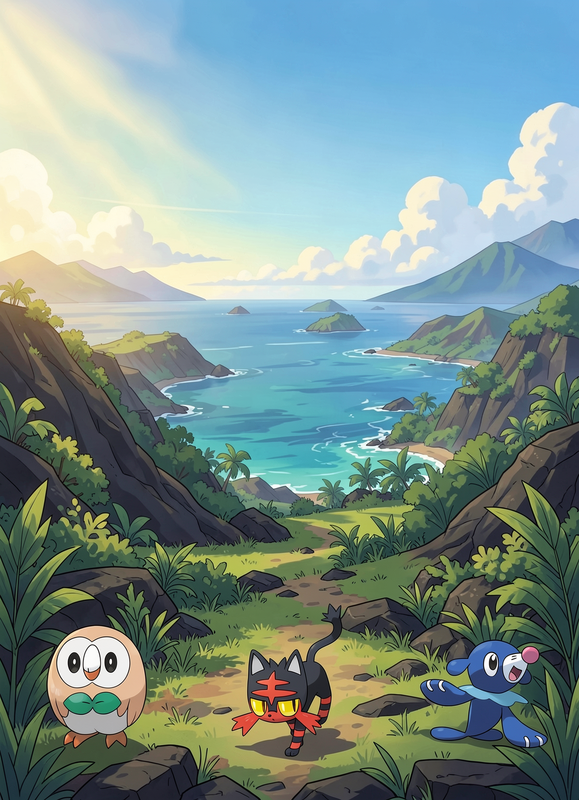

#### P10 – Bauz · unten links

Bisheriger Agentencheck: beanstandet. Deine Bewertung: offen.

| Kartenausschnitt | Quell-Pokémon |
| --- | --- |
|  |  |

[Zuschnitt in Originalauflösung](../../tmp/panorama-audit-aggregate/Pokedex/sections/gen7/card_r3_c1.png) · [Quellbild in Originalauflösung](../../tmp/poster-workspaces/Pokedex/sections/gen7/sources/cutouts/pokemon_722_rowlet.png)

#### P10 – Flamiau · unten Mitte

Bisheriger Agentencheck: bestanden. Deine Bewertung: offen.

| Kartenausschnitt | Quell-Pokémon |
| --- | --- |
|  |  |

[Zuschnitt in Originalauflösung](../../tmp/panorama-audit-aggregate/Pokedex/sections/gen7/card_r3_c2.png) · [Quellbild in Originalauflösung](../../tmp/poster-workspaces/Pokedex/sections/gen7/sources/cutouts/pokemon_725_litten.png)

#### P10 – Robball · unten rechts

Bisheriger Agentencheck: bestanden. Deine Bewertung: offen.

| Kartenausschnitt | Quell-Pokémon |
| --- | --- |
|  |  |

[Zuschnitt in Originalauflösung](../../tmp/panorama-audit-aggregate/Pokedex/sections/gen7/card_r3_c3.png) · [Quellbild in Originalauflösung](../../tmp/poster-workspaces/Pokedex/sections/gen7/sources/cutouts/pokemon_728_popplio.png)

[Prüfbericht](2026-09-12-panorama-audit-aggregate.json)

Bildkennung: `2cf724beabc3c2a2` (vollständiger Hash im zugehörigen JSON-Snapshot).

### P11 – Pokédex – Generation VIII (Pokedex/sections/gen8)

**Deine Bewertung: offen.** 2 Figur(en) beanstandet, 1 unklar.

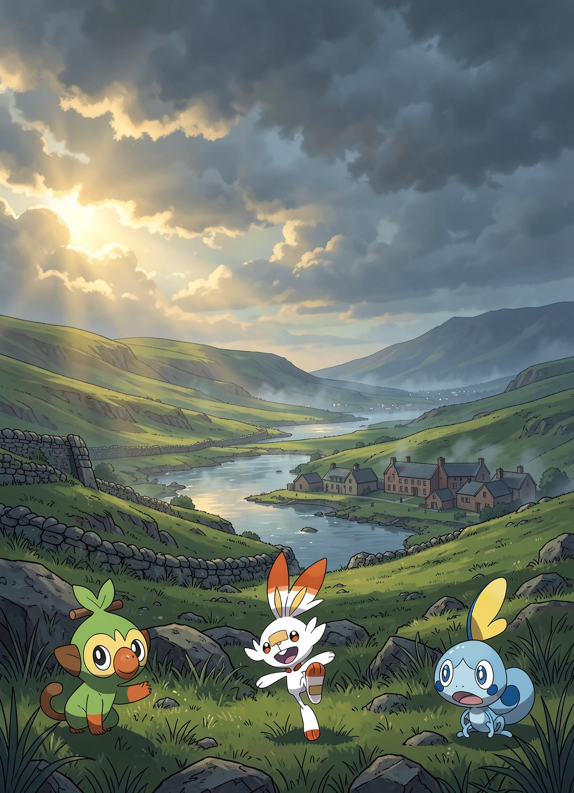

#### P11 – Chimpep · unten links

Bisheriger Agentencheck: unklar. Deine Bewertung: offen.

| Kartenausschnitt | Quell-Pokémon |
| --- | --- |
|  |  |

[Zuschnitt in Originalauflösung](../../tmp/panorama-audit-aggregate/Pokedex/sections/gen8/card_r3_c1.png) · [Quellbild in Originalauflösung](../../tmp/poster-workspaces/Pokedex/sections/gen8/sources/cutouts/pokemon_810_grookey.png)

#### P11 – Hopplo · unten Mitte

Bisheriger Agentencheck: beanstandet. Deine Bewertung: offen.

| Kartenausschnitt | Quell-Pokémon |
| --- | --- |
|  |  |

[Zuschnitt in Originalauflösung](../../tmp/panorama-audit-aggregate/Pokedex/sections/gen8/card_r3_c2.png) · [Quellbild in Originalauflösung](../../tmp/poster-workspaces/Pokedex/sections/gen8/sources/cutouts/pokemon_813_scorbunny.png)

#### P11 – Memmeon · unten rechts

Bisheriger Agentencheck: beanstandet. Deine Bewertung: offen.

| Kartenausschnitt | Quell-Pokémon |
| --- | --- |
|  |  |

[Zuschnitt in Originalauflösung](../../tmp/panorama-audit-aggregate/Pokedex/sections/gen8/card_r3_c3.png) · [Quellbild in Originalauflösung](../../tmp/poster-workspaces/Pokedex/sections/gen8/sources/cutouts/pokemon_816_sobble.png)

[Prüfbericht](2026-09-12-panorama-audit-aggregate.json)

Bildkennung: `22cc4173999d2a59` (vollständiger Hash im zugehörigen JSON-Snapshot).

### P12 – Pokédex – Generation IX (Pokedex/sections/gen9)

**Deine Bewertung: offen.** 2 Figur(en) beanstandet.

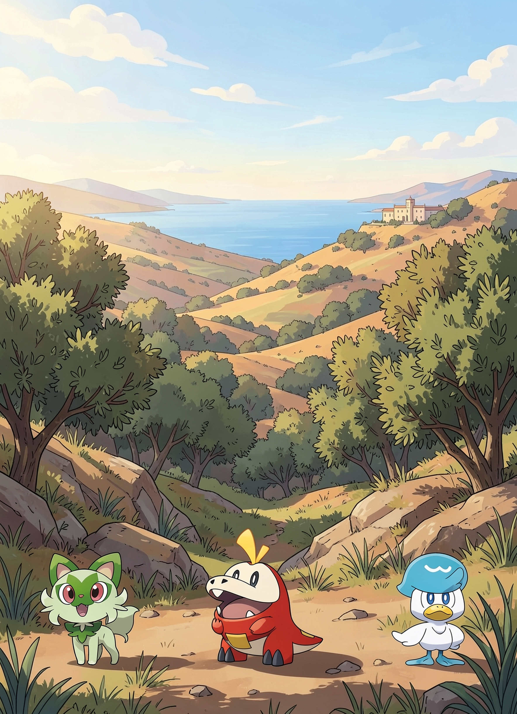

#### P12 – Felori · unten links

Bisheriger Agentencheck: beanstandet. Deine Bewertung: offen.

| Kartenausschnitt | Quell-Pokémon |
| --- | --- |
|  |  |

[Zuschnitt in Originalauflösung](../../tmp/panorama-audit-aggregate/Pokedex/sections/gen9/card_r3_c1.png) · [Quellbild in Originalauflösung](../../tmp/poster-workspaces/Pokedex/sections/gen9/sources/cutouts/pokemon_906_sprigatito.png)

#### P12 – Krokel · unten Mitte

Bisheriger Agentencheck: bestanden. Deine Bewertung: offen.

| Kartenausschnitt | Quell-Pokémon |
| --- | --- |
|  |  |

[Zuschnitt in Originalauflösung](../../tmp/panorama-audit-aggregate/Pokedex/sections/gen9/card_r3_c2.png) · [Quellbild in Originalauflösung](../../tmp/poster-workspaces/Pokedex/sections/gen9/sources/cutouts/pokemon_909_fuecoco.png)

#### P12 – Kwaks · unten rechts

Bisheriger Agentencheck: beanstandet. Deine Bewertung: offen.

| Kartenausschnitt | Quell-Pokémon |
| --- | --- |
|  |  |

[Zuschnitt in Originalauflösung](../../tmp/panorama-audit-aggregate/Pokedex/sections/gen9/card_r3_c3.png) · [Quellbild in Originalauflösung](../../tmp/poster-workspaces/Pokedex/sections/gen9/sources/cutouts/pokemon_912_quaxly.png)

[Prüfbericht](2026-09-12-panorama-audit-aggregate.json)

Bildkennung: `9b69d26e7fce0838` (vollständiger Hash im zugehörigen JSON-Snapshot).

### P13 – Pokémon ex - Generation 1 (ExGen1/sections/normal)

**Deine Bewertung: offen.** 2 Figur(en) beanstandet.

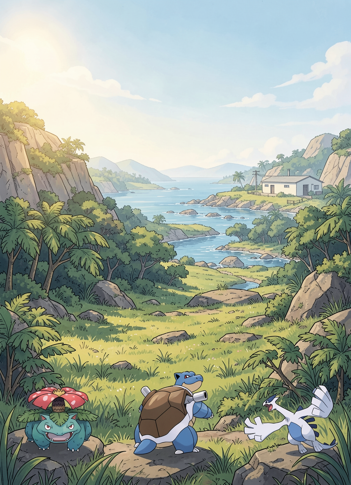

#### P13 – Bisaflor · unten links

Bisheriger Agentencheck: beanstandet. Deine Bewertung: offen.

| Kartenausschnitt | Quell-Pokémon |
| --- | --- |
|  |  |

[Zuschnitt in Originalauflösung](../../tmp/panorama-audit-aggregate/ExGen1/sections/normal/card_r3_c1.png) · [Quellbild in Originalauflösung](../../tmp/poster-workspaces/ExGen1/sections/normal/sources/cutouts/pokemon_003_venusaur.png)

#### P13 – Turtok · unten Mitte

Bisheriger Agentencheck: bestanden. Deine Bewertung: offen.

| Kartenausschnitt | Quell-Pokémon |
| --- | --- |
|  |  |

[Zuschnitt in Originalauflösung](../../tmp/panorama-audit-aggregate/ExGen1/sections/normal/card_r3_c2.png) · [Quellbild in Originalauflösung](../../tmp/poster-workspaces/ExGen1/sections/normal/sources/cutouts/pokemon_009_blastoise.png)

#### P13 – Lugia · unten rechts

Bisheriger Agentencheck: beanstandet. Deine Bewertung: offen.

| Kartenausschnitt | Quell-Pokémon |
| --- | --- |
|  |  |

[Zuschnitt in Originalauflösung](../../tmp/panorama-audit-aggregate/ExGen1/sections/normal/card_r3_c3.png) · [Quellbild in Originalauflösung](../../tmp/poster-workspaces/ExGen1/sections/normal/sources/cutouts/pokemon_249_lugia.png)

[Prüfbericht](2026-09-12-panorama-audit-aggregate.json)

Bildkennung: `80457937f2507257` (vollständiger Hash im zugehörigen JSON-Snapshot).

### P14 – Pokémon EX (ExGen2/sections/normal)

**Deine Bewertung: offen.** 3 Figur(en) beanstandet.

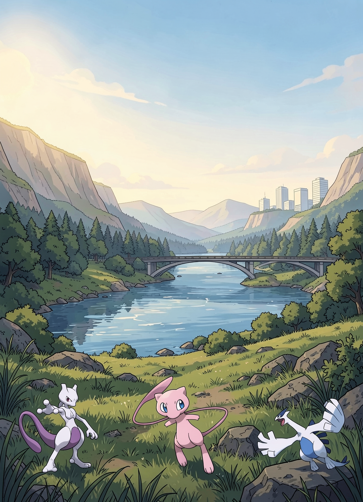

#### P14 – Mewtu · unten links

Bisheriger Agentencheck: beanstandet. Deine Bewertung: offen.

| Kartenausschnitt | Quell-Pokémon |
| --- | --- |
|  |  |

[Zuschnitt in Originalauflösung](../../tmp/panorama-audit-aggregate/ExGen2/sections/normal/card_r3_c1.png) · [Quellbild in Originalauflösung](../../tmp/poster-workspaces/ExGen2/sections/normal/sources/cutouts/pokemon_150_mewtwo.png)

#### P14 – Mew · unten Mitte

Bisheriger Agentencheck: beanstandet. Deine Bewertung: offen.

| Kartenausschnitt | Quell-Pokémon |
| --- | --- |
|  |  |

[Zuschnitt in Originalauflösung](../../tmp/panorama-audit-aggregate/ExGen2/sections/normal/card_r3_c2.png) · [Quellbild in Originalauflösung](../../tmp/poster-workspaces/ExGen2/sections/normal/sources/cutouts/pokemon_151_mew.png)

#### P14 – Lugia · unten rechts

Bisheriger Agentencheck: beanstandet. Deine Bewertung: offen.

| Kartenausschnitt | Quell-Pokémon |
| --- | --- |
|  |  |

[Zuschnitt in Originalauflösung](../../tmp/panorama-audit-aggregate/ExGen2/sections/normal/card_r3_c3.png) · [Quellbild in Originalauflösung](../../tmp/poster-workspaces/ExGen2/sections/normal/sources/cutouts/pokemon_249_lugia.png)

[Prüfbericht](2026-09-12-panorama-audit-aggregate.json)

Bildkennung: `f968cb0b1687c485` (vollständiger Hash im zugehörigen JSON-Snapshot).

### P15 – Mega-Pokémon EX (ExGen2/sections/mega)

**Deine Bewertung: offen.** 3 Figur(en) beanstandet.

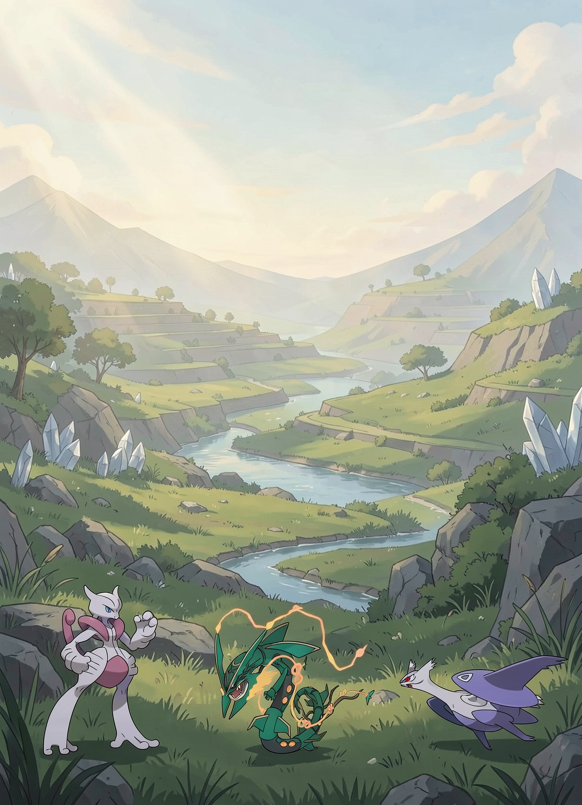

#### P15 – Mega-Mewtu X · unten links

Bisheriger Agentencheck: beanstandet. Deine Bewertung: offen.

| Kartenausschnitt | Quell-Pokémon |
| --- | --- |
|  |  |

[Zuschnitt in Originalauflösung](../../tmp/panorama-audit-aggregate/ExGen2/sections/mega/card_r3_c1.png) · [Quellbild in Originalauflösung](../../tmp/poster-workspaces/ExGen2/sections/mega/sources/cutouts/pokemon_150_artwork_10043_mega_mewtwo_x.png)

#### P15 – Mega-Rayquaza · unten Mitte

Bisheriger Agentencheck: beanstandet. Deine Bewertung: offen.

| Kartenausschnitt | Quell-Pokémon |
| --- | --- |
|  |  |

[Zuschnitt in Originalauflösung](../../tmp/panorama-audit-aggregate/ExGen2/sections/mega/card_r3_c2.png) · [Quellbild in Originalauflösung](../../tmp/poster-workspaces/ExGen2/sections/mega/sources/cutouts/pokemon_384_artwork_10079_mega_rayquaza.png)

#### P15 – Mega-Latios · unten rechts

Bisheriger Agentencheck: beanstandet. Deine Bewertung: offen.

| Kartenausschnitt | Quell-Pokémon |
| --- | --- |
|  |  |

[Zuschnitt in Originalauflösung](../../tmp/panorama-audit-aggregate/ExGen2/sections/mega/card_r3_c3.png) · [Quellbild in Originalauflösung](../../tmp/poster-workspaces/ExGen2/sections/mega/sources/cutouts/pokemon_381_artwork_10063_mega_latios.png)

[Prüfbericht](2026-09-12-panorama-audit-aggregate.json)

Bildkennung: `51a3ceff402561ce` (vollständiger Hash im zugehörigen JSON-Snapshot).

### P16 – Primal Pokémon EX (ExGen2/sections/primal)

**Deine Bewertung: offen.** 2 Figur(en) beanstandet.

#### P16 – Proto-Kyogre · unten links

Bisheriger Agentencheck: beanstandet. Deine Bewertung: offen.

| Kartenausschnitt | Quell-Pokémon |
| --- | --- |
|  |  |

[Zuschnitt in Originalauflösung](../../tmp/panorama-audit-aggregate/ExGen2/sections/primal/card_r3_c1.png) · [Quellbild in Originalauflösung](../../tmp/poster-workspaces/ExGen2/sections/primal/sources/cutouts/pokemon_382_artwork_10077_primal_kyogre.png)

#### P16 – Proto-Groudon · unten rechts

Bisheriger Agentencheck: beanstandet. Deine Bewertung: offen.

| Kartenausschnitt | Quell-Pokémon |
| --- | --- |
|  |  |

[Zuschnitt in Originalauflösung](../../tmp/panorama-audit-aggregate/ExGen2/sections/primal/card_r3_c3.png) · [Quellbild in Originalauflösung](../../tmp/poster-workspaces/ExGen2/sections/primal/sources/cutouts/pokemon_383_artwork_10078_primal_groudon.png)

[Prüfbericht](2026-09-12-panorama-audit-aggregate.json)

Bildkennung: `74c828b35bbf41bd` (vollständiger Hash im zugehörigen JSON-Snapshot).

### P17 – Fossil (Base3)

**Deine Bewertung: offen.** 2 Figur(en) beanstandet, 1 unklar.

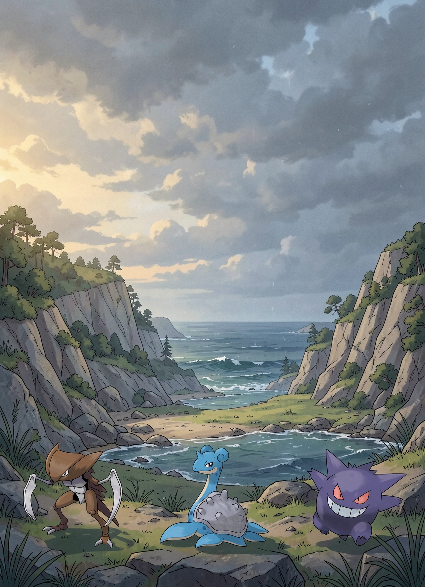

#### P17 – Kabutops · unten links

Bisheriger Agentencheck: beanstandet. Deine Bewertung: offen.

| Kartenausschnitt | Quell-Pokémon |
| --- | --- |
|  |  |

[Zuschnitt in Originalauflösung](../../tmp/poster-workspaces/Base3/comfyui_poster/promotion/poster-flux2-cards/card_r3_c1.png) · [Quellbild in Originalauflösung](../../tmp/poster-workspaces/Base3/sources/cutouts/pokemon_141_kabutops.png)

#### P17 – Lapras · unten Mitte

Bisheriger Agentencheck: beanstandet. Deine Bewertung: offen.

| Kartenausschnitt | Quell-Pokémon |
| --- | --- |
|  |  |

[Zuschnitt in Originalauflösung](../../tmp/poster-workspaces/Base3/comfyui_poster/promotion/poster-flux2-cards/card_r3_c2.png) · [Quellbild in Originalauflösung](../../tmp/poster-workspaces/Base3/sources/cutouts/pokemon_131_lapras.png)

#### P17 – Gengar · unten rechts

Bisheriger Agentencheck: unklar. Deine Bewertung: offen.

| Kartenausschnitt | Quell-Pokémon |
| --- | --- |
|  |  |

[Zuschnitt in Originalauflösung](../../tmp/poster-workspaces/Base3/comfyui_poster/promotion/poster-flux2-cards/card_r3_c3.png) · [Quellbild in Originalauflösung](../../tmp/poster-workspaces/Base3/sources/cutouts/pokemon_094_gengar.png)

[Vorhandene Fassung mit Beschriftung](../../tmp/poster-workspaces/Base3/comfyui_poster/promotion/poster-flux2.png) · [Prüfbericht](2026-09-12-panorama-audit-early-tcg.json)

Bildkennung: `aa861af2f9b21294` (vollständiger Hash im zugehörigen JSON-Snapshot).

### P18 – Karmesin & Purpur (SV01)

**Deine Bewertung: offen.** 1 Figur(en) beanstandet, 1 unklar.

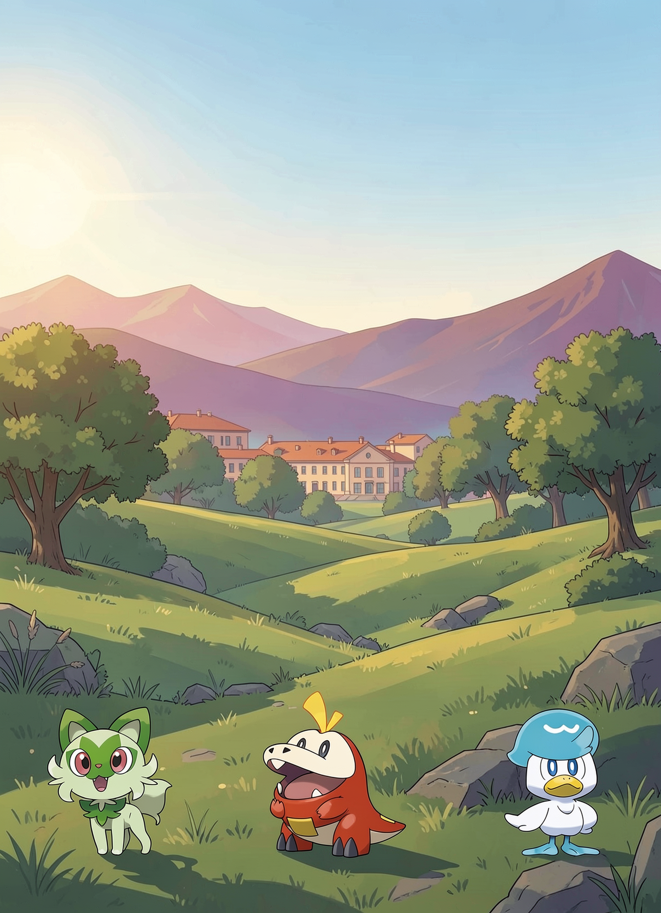

#### P18 – Felori · unten links

Bisheriger Agentencheck: beanstandet. Deine Bewertung: offen.

| Kartenausschnitt | Quell-Pokémon |
| --- | --- |
|  |  |

[Zuschnitt in Originalauflösung](../../tmp/poster-workspaces/SV01/comfyui_poster/promotion/poster-flux2-cards/card_r3_c1.png) · [Quellbild in Originalauflösung](../../tmp/poster-workspaces/SV01/sources/cutouts/pokemon_906_sprigatito.png)

#### P18 – Krokel · unten Mitte

Bisheriger Agentencheck: unklar. Deine Bewertung: offen.

| Kartenausschnitt | Quell-Pokémon |
| --- | --- |
|  |  |

[Zuschnitt in Originalauflösung](../../tmp/poster-workspaces/SV01/comfyui_poster/promotion/poster-flux2-cards/card_r3_c2.png) · [Quellbild in Originalauflösung](../../tmp/poster-workspaces/SV01/sources/cutouts/pokemon_909_fuecoco.png)

#### P18 – Kwaks · unten rechts

Bisheriger Agentencheck: bestanden. Deine Bewertung: offen.

| Kartenausschnitt | Quell-Pokémon |
| --- | --- |
|  |  |

[Zuschnitt in Originalauflösung](../../tmp/poster-workspaces/SV01/comfyui_poster/promotion/poster-flux2-cards/card_r3_c3.png) · [Quellbild in Originalauflösung](../../tmp/poster-workspaces/SV01/sources/cutouts/pokemon_912_quaxly.png)

[Vorhandene Fassung mit Beschriftung](../../tmp/poster-workspaces/SV01/comfyui_poster/promotion/poster-flux2.png) · [Prüfbericht](2026-09-12-panorama-audit-early-tcg.json)

Bildkennung: `0c5b398a2b5bd52c` (vollständiger Hash im zugehörigen JSON-Snapshot).

### P19 – Entwicklungen in Paldea (SV02)

**Deine Bewertung: offen.** 2 Figur(en) beanstandet, 1 unklar.

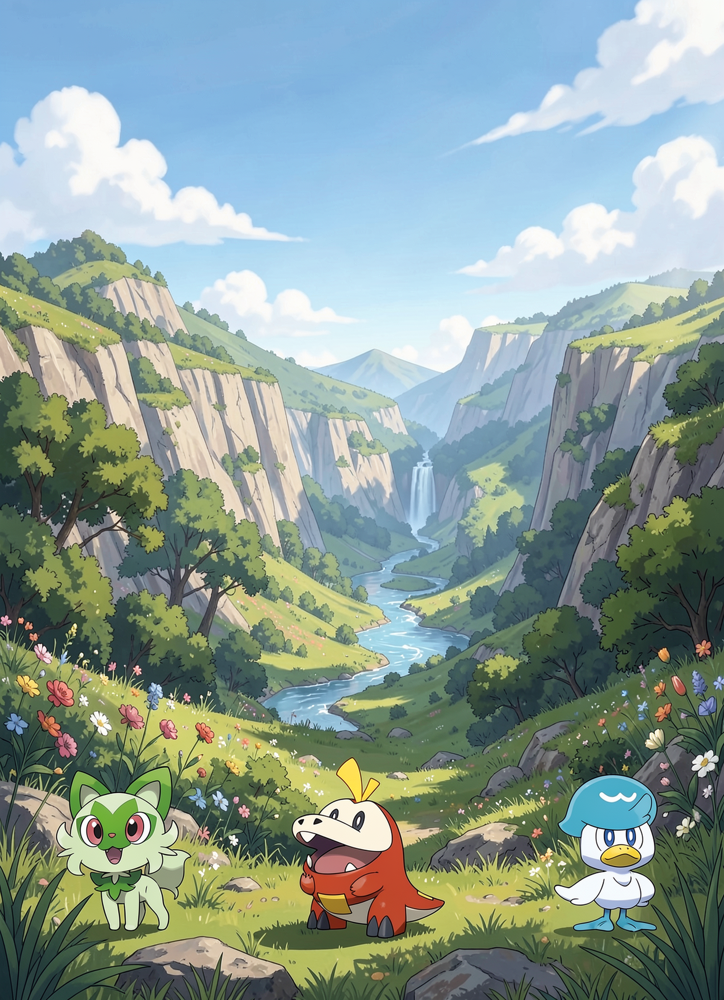

#### P19 – Felori · unten links

Bisheriger Agentencheck: beanstandet. Deine Bewertung: offen.

| Kartenausschnitt | Quell-Pokémon |
| --- | --- |
|  |  |

[Zuschnitt in Originalauflösung](../../tmp/poster-workspaces/SV02/comfyui_poster/promotion/poster-flux2-cards/card_r3_c1.png) · [Quellbild in Originalauflösung](../../tmp/poster-workspaces/SV02/sources/cutouts/pokemon_906_sprigatito.png)

#### P19 – Krokel · unten Mitte

Bisheriger Agentencheck: beanstandet. Deine Bewertung: offen.

| Kartenausschnitt | Quell-Pokémon |
| --- | --- |
|  |  |

[Zuschnitt in Originalauflösung](../../tmp/poster-workspaces/SV02/comfyui_poster/promotion/poster-flux2-cards/card_r3_c2.png) · [Quellbild in Originalauflösung](../../tmp/poster-workspaces/SV02/sources/cutouts/pokemon_909_fuecoco.png)

#### P19 – Kwaks · unten rechts

Bisheriger Agentencheck: unklar. Deine Bewertung: offen.

| Kartenausschnitt | Quell-Pokémon |
| --- | --- |
|  |  |

[Zuschnitt in Originalauflösung](../../tmp/poster-workspaces/SV02/comfyui_poster/promotion/poster-flux2-cards/card_r3_c3.png) · [Quellbild in Originalauflösung](../../tmp/poster-workspaces/SV02/sources/cutouts/pokemon_912_quaxly.png)

[Vorhandene Fassung mit Beschriftung](../../tmp/poster-workspaces/SV02/comfyui_poster/promotion/poster-flux2.png) · [Prüfbericht](2026-09-12-panorama-audit-early-tcg.json)

Bildkennung: `54aff4959b4c4082` (vollständiger Hash im zugehörigen JSON-Snapshot).

### P20 – Obsidian Flammen (SV03)

**Deine Bewertung: offen.** 2 Figur(en) beanstandet.

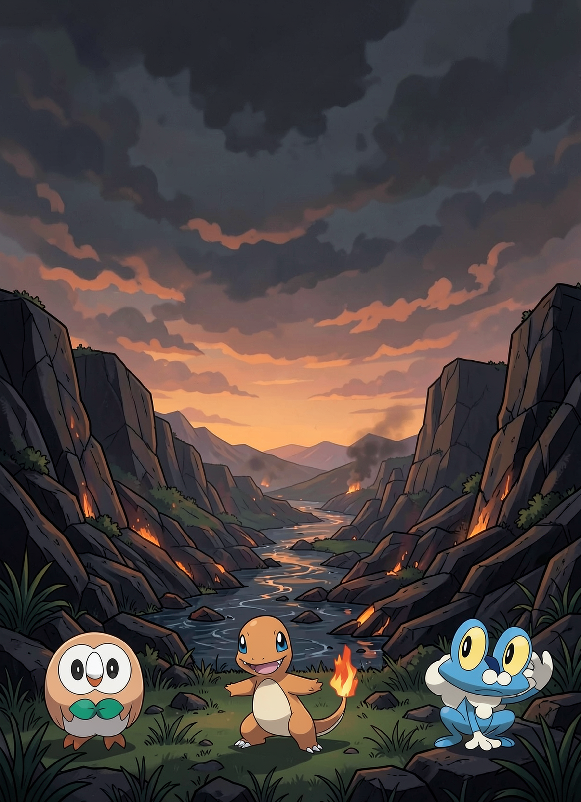

#### P20 – Bauz · unten links

Bisheriger Agentencheck: beanstandet. Deine Bewertung: offen.

| Kartenausschnitt | Quell-Pokémon |
| --- | --- |
|  |  |

[Zuschnitt in Originalauflösung](../../tmp/poster-workspaces/SV03/comfyui_poster/promotion/poster-flux2-cards/card_r3_c1.png) · [Quellbild in Originalauflösung](../../tmp/poster-workspaces/SV03/sources/cutouts/pokemon_722_rowlet.png)

#### P20 – Glumanda · unten Mitte

Bisheriger Agentencheck: beanstandet. Deine Bewertung: offen.

| Kartenausschnitt | Quell-Pokémon |
| --- | --- |
|  |  |

[Zuschnitt in Originalauflösung](../../tmp/poster-workspaces/SV03/comfyui_poster/promotion/poster-flux2-cards/card_r3_c2.png) · [Quellbild in Originalauflösung](../../tmp/poster-workspaces/SV03/sources/cutouts/pokemon_004_charmander.png)

#### P20 – Froxy · unten rechts

Bisheriger Agentencheck: bestanden. Deine Bewertung: offen.

| Kartenausschnitt | Quell-Pokémon |
| --- | --- |
|  |  |

[Zuschnitt in Originalauflösung](../../tmp/poster-workspaces/SV03/comfyui_poster/promotion/poster-flux2-cards/card_r3_c3.png) · [Quellbild in Originalauflösung](../../tmp/poster-workspaces/SV03/sources/cutouts/pokemon_656_froakie.png)

[Vorhandene Fassung mit Beschriftung](../../tmp/poster-workspaces/SV03/comfyui_poster/promotion/poster-flux2.png) · [Prüfbericht](2026-09-12-panorama-audit-early-tcg.json)

Bildkennung: `96edafdfdbdf95e8` (vollständiger Hash im zugehörigen JSON-Snapshot).

### P21 – 151 (SV03.5)

**Deine Bewertung: offen.** 2 Figur(en) beanstandet, 1 unklar.

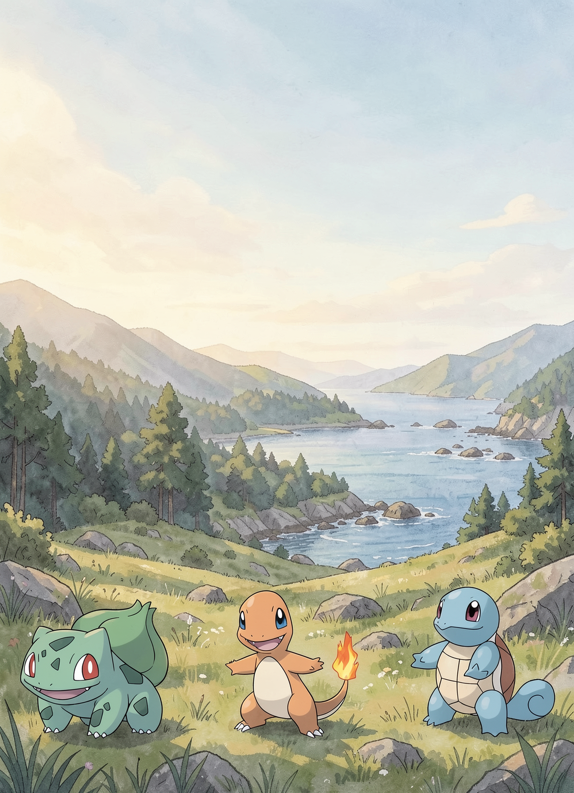

#### P21 – Bisasam · unten links

Bisheriger Agentencheck: beanstandet. Deine Bewertung: offen.

| Kartenausschnitt | Quell-Pokémon |
| --- | --- |
|  |  |

[Zuschnitt in Originalauflösung](../../tmp/poster-workspaces/SV03.5/comfyui_poster/promotion/poster-flux2-cards/card_r3_c1.png) · [Quellbild in Originalauflösung](../../tmp/poster-workspaces/SV03.5/sources/cutouts/pokemon_001_bulbasaur.png)

#### P21 – Glumanda · unten Mitte

Bisheriger Agentencheck: beanstandet. Deine Bewertung: offen.

| Kartenausschnitt | Quell-Pokémon |
| --- | --- |
|  |  |

[Zuschnitt in Originalauflösung](../../tmp/poster-workspaces/SV03.5/comfyui_poster/promotion/poster-flux2-cards/card_r3_c2.png) · [Quellbild in Originalauflösung](../../tmp/poster-workspaces/SV03.5/sources/cutouts/pokemon_004_charmander.png)

#### P21 – Schiggy · unten rechts

Bisheriger Agentencheck: unklar. Deine Bewertung: offen.

| Kartenausschnitt | Quell-Pokémon |
| --- | --- |
|  |  |

[Zuschnitt in Originalauflösung](../../tmp/poster-workspaces/SV03.5/comfyui_poster/promotion/poster-flux2-cards/card_r3_c3.png) · [Quellbild in Originalauflösung](../../tmp/poster-workspaces/SV03.5/sources/cutouts/pokemon_007_squirtle.png)

[Vorhandene Fassung mit Beschriftung](../../tmp/poster-workspaces/SV03.5/comfyui_poster/promotion/poster-flux2.png) · [Prüfbericht](2026-09-12-panorama-audit-early-tcg.json)

Bildkennung: `727efeda4772538d` (vollständiger Hash im zugehörigen JSON-Snapshot).

### P22 – Paradoxrift (SV04)

**Deine Bewertung: offen.** 3 Figur(en) beanstandet.

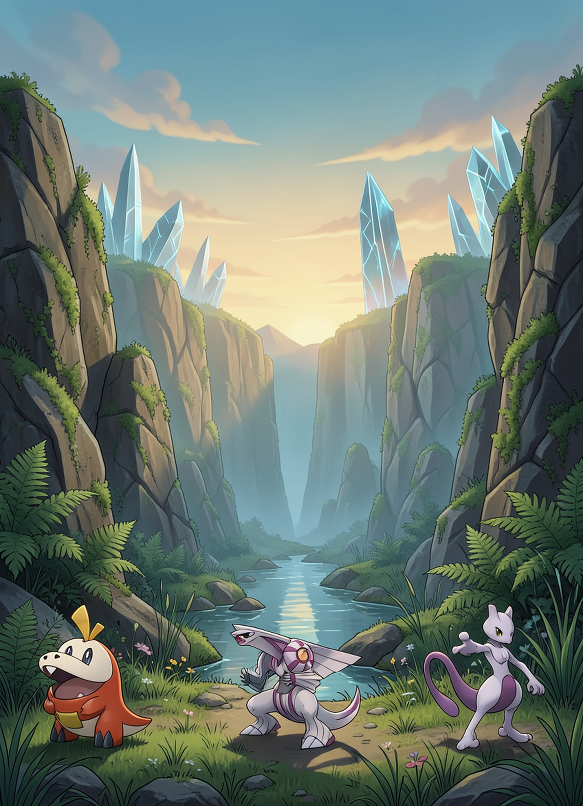

#### P22 – Krokel · unten links

Bisheriger Agentencheck: beanstandet. Deine Bewertung: offen.

| Kartenausschnitt | Quell-Pokémon |
| --- | --- |
|  |  |

[Zuschnitt in Originalauflösung](../../tmp/poster-workspaces/SV04/comfyui_poster/promotion/poster-flux2-cards/card_r3_c1.png) · [Quellbild in Originalauflösung](../../tmp/poster-workspaces/SV04/sources/cutouts/pokemon_909_fuecoco.png)

#### P22 – Palkia · unten Mitte

Bisheriger Agentencheck: beanstandet. Deine Bewertung: offen.

| Kartenausschnitt | Quell-Pokémon |
| --- | --- |
|  |  |

[Zuschnitt in Originalauflösung](../../tmp/poster-workspaces/SV04/comfyui_poster/promotion/poster-flux2-cards/card_r3_c2.png) · [Quellbild in Originalauflösung](../../tmp/poster-workspaces/SV04/sources/cutouts/pokemon_484_palkia.png)

#### P22 – Mewtu · unten rechts

Bisheriger Agentencheck: beanstandet. Deine Bewertung: offen.

| Kartenausschnitt | Quell-Pokémon |
| --- | --- |
|  |  |

[Zuschnitt in Originalauflösung](../../tmp/poster-workspaces/SV04/comfyui_poster/promotion/poster-flux2-cards/card_r3_c3.png) · [Quellbild in Originalauflösung](../../tmp/poster-workspaces/SV04/sources/cutouts/pokemon_150_mewtwo.png)

[Vorhandene Fassung mit Beschriftung](../../tmp/poster-workspaces/SV04/comfyui_poster/promotion/poster-flux2.png) · [Prüfbericht](2026-09-12-panorama-audit-early-tcg.json)

Bildkennung: `fbef96b80f577aca` (vollständiger Hash im zugehörigen JSON-Snapshot).

### P23 – Paldeas Schicksale (SV04.5)

**Deine Bewertung: offen.** 1 Figur(en) beanstandet, 1 unklar.

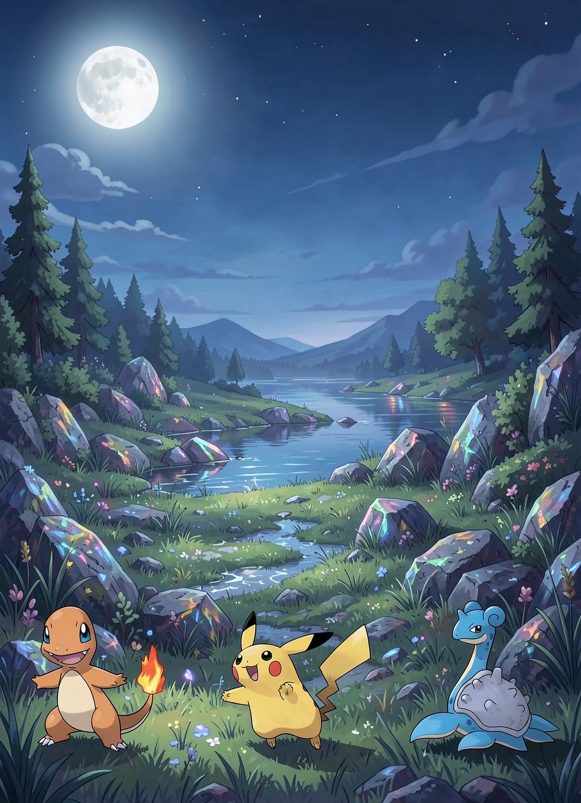

#### P23 – Glumanda · unten links

Bisheriger Agentencheck: beanstandet. Deine Bewertung: offen.

| Kartenausschnitt | Quell-Pokémon |
| --- | --- |
|  |  |

[Zuschnitt in Originalauflösung](../../tmp/poster-workspaces/SV04.5/comfyui_poster/promotion/poster-flux2-cards/card_r3_c1.png) · [Quellbild in Originalauflösung](../../tmp/poster-workspaces/SV04.5/sources/cutouts/pokemon_004_charmander.png)

#### P23 – Pikachu · unten Mitte

Bisheriger Agentencheck: unklar. Deine Bewertung: offen.

| Kartenausschnitt | Quell-Pokémon |
| --- | --- |
|  |  |

[Zuschnitt in Originalauflösung](../../tmp/poster-workspaces/SV04.5/comfyui_poster/promotion/poster-flux2-cards/card_r3_c2.png) · [Quellbild in Originalauflösung](../../tmp/poster-workspaces/SV04.5/sources/cutouts/pokemon_025_pikachu.png)

#### P23 – Lapras · unten rechts

Bisheriger Agentencheck: bestanden. Deine Bewertung: offen.

| Kartenausschnitt | Quell-Pokémon |
| --- | --- |
|  |  |

[Zuschnitt in Originalauflösung](../../tmp/poster-workspaces/SV04.5/comfyui_poster/promotion/poster-flux2-cards/card_r3_c3.png) · [Quellbild in Originalauflösung](../../tmp/poster-workspaces/SV04.5/sources/cutouts/pokemon_131_lapras.png)

[Vorhandene Fassung mit Beschriftung](../../tmp/poster-workspaces/SV04.5/comfyui_poster/promotion/poster-flux2.png) · [Prüfbericht](2026-09-12-panorama-audit-early-tcg.json)

Bildkennung: `05a519ec108167e8` (vollständiger Hash im zugehörigen JSON-Snapshot).

### P24 – Gewalten der Zeit (SV05)

**Deine Bewertung: offen.** 2 Figur(en) beanstandet, 1 unklar.

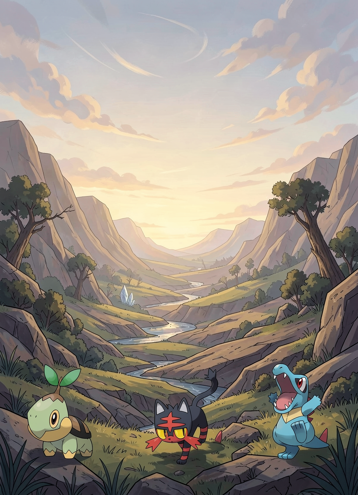

#### P24 – Chelast · unten links

Bisheriger Agentencheck: unklar. Deine Bewertung: offen.

| Kartenausschnitt | Quell-Pokémon |
| --- | --- |
|  |  |

[Zuschnitt in Originalauflösung](../../tmp/poster-workspaces/SV05/comfyui_poster/promotion/poster-flux2-cards/card_r3_c1.png) · [Quellbild in Originalauflösung](../../tmp/poster-workspaces/SV05/sources/cutouts/pokemon_387_turtwig.png)

#### P24 – Flamiau · unten Mitte

Bisheriger Agentencheck: beanstandet. Deine Bewertung: offen.

| Kartenausschnitt | Quell-Pokémon |
| --- | --- |
|  |  |

[Zuschnitt in Originalauflösung](../../tmp/poster-workspaces/SV05/comfyui_poster/promotion/poster-flux2-cards/card_r3_c2.png) · [Quellbild in Originalauflösung](../../tmp/poster-workspaces/SV05/sources/cutouts/pokemon_725_litten.png)

#### P24 – Karnimani · unten rechts

Bisheriger Agentencheck: beanstandet. Deine Bewertung: offen.

| Kartenausschnitt | Quell-Pokémon |
| --- | --- |
|  |  |

[Zuschnitt in Originalauflösung](../../tmp/poster-workspaces/SV05/comfyui_poster/promotion/poster-flux2-cards/card_r3_c3.png) · [Quellbild in Originalauflösung](../../tmp/poster-workspaces/SV05/sources/cutouts/pokemon_158_totodile.png)

[Vorhandene Fassung mit Beschriftung](../../tmp/poster-workspaces/SV05/comfyui_poster/promotion/poster-flux2.png) · [Prüfbericht](2026-09-12-panorama-audit-early-tcg.json)

Bildkennung: `2e0deba9d4194f6b` (vollständiger Hash im zugehörigen JSON-Snapshot).

### P25 – Maskerade im Zwielicht (SV06)

**Deine Bewertung: offen.** 1 Figur(en) beanstandet, 1 unklar.

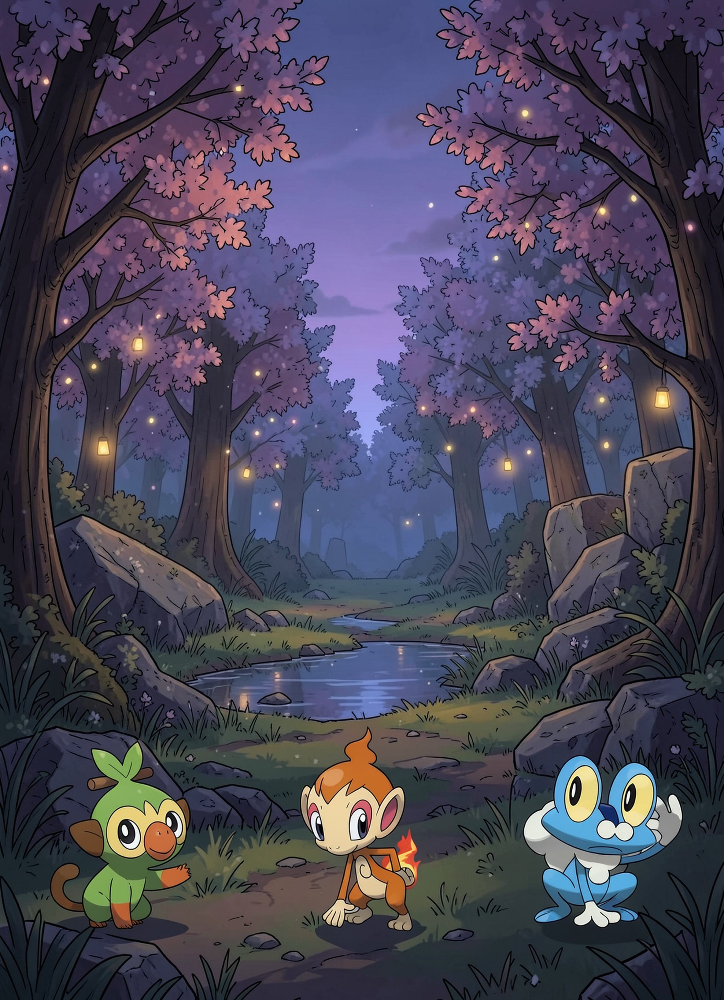

#### P25 – Chimpep · unten links

Bisheriger Agentencheck: beanstandet. Deine Bewertung: offen.

| Kartenausschnitt | Quell-Pokémon |
| --- | --- |
|  |  |

[Zuschnitt in Originalauflösung](../../tmp/poster-workspaces/SV06/comfyui_poster/promotion/poster-flux2-cards/card_r3_c1.png) · [Quellbild in Originalauflösung](../../tmp/poster-workspaces/SV06/sources/cutouts/pokemon_810_grookey.png)

#### P25 – Panflam · unten Mitte

Bisheriger Agentencheck: unklar. Deine Bewertung: offen.

| Kartenausschnitt | Quell-Pokémon |
| --- | --- |
|  |  |

[Zuschnitt in Originalauflösung](../../tmp/poster-workspaces/SV06/comfyui_poster/promotion/poster-flux2-cards/card_r3_c2.png) · [Quellbild in Originalauflösung](../../tmp/poster-workspaces/SV06/sources/cutouts/pokemon_390_chimchar.png)

#### P25 – Froxy · unten rechts

Bisheriger Agentencheck: bestanden. Deine Bewertung: offen.

| Kartenausschnitt | Quell-Pokémon |
| --- | --- |
|  |  |

[Zuschnitt in Originalauflösung](../../tmp/poster-workspaces/SV06/comfyui_poster/promotion/poster-flux2-cards/card_r3_c3.png) · [Quellbild in Originalauflösung](../../tmp/poster-workspaces/SV06/sources/cutouts/pokemon_656_froakie.png)

[Vorhandene Fassung mit Beschriftung](../../tmp/poster-workspaces/SV06/comfyui_poster/promotion/poster-flux2.png) · [Prüfbericht](2026-09-12-panorama-audit-early-tcg.json)

Bildkennung: `a94d925d2e6d5a25` (vollständiger Hash im zugehörigen JSON-Snapshot).

### P26 – Nebel der Sagen (SV06.5)

**Deine Bewertung: offen.** 2 Figur(en) beanstandet, 1 unklar.

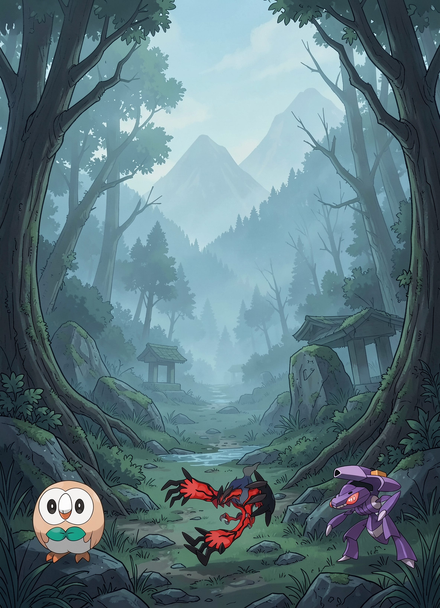

#### P26 – Bauz · unten links

Bisheriger Agentencheck: beanstandet. Deine Bewertung: offen.

| Kartenausschnitt | Quell-Pokémon |
| --- | --- |
|  |  |

[Zuschnitt in Originalauflösung](../../tmp/poster-workspaces/SV06.5/comfyui_poster/promotion/poster-flux2-cards/card_r3_c1.png) · [Quellbild in Originalauflösung](../../tmp/poster-workspaces/SV06.5/sources/cutouts/pokemon_722_rowlet.png)

#### P26 – Yveltal · unten Mitte

Bisheriger Agentencheck: beanstandet. Deine Bewertung: offen.

| Kartenausschnitt | Quell-Pokémon |
| --- | --- |
|  |  |

[Zuschnitt in Originalauflösung](../../tmp/poster-workspaces/SV06.5/comfyui_poster/promotion/poster-flux2-cards/card_r3_c2.png) · [Quellbild in Originalauflösung](../../tmp/poster-workspaces/SV06.5/sources/cutouts/pokemon_717_yveltal.png)

#### P26 – Genesect · unten rechts

Bisheriger Agentencheck: unklar. Deine Bewertung: offen.

| Kartenausschnitt | Quell-Pokémon |
| --- | --- |
|  |  |

[Zuschnitt in Originalauflösung](../../tmp/poster-workspaces/SV06.5/comfyui_poster/promotion/poster-flux2-cards/card_r3_c3.png) · [Quellbild in Originalauflösung](../../tmp/poster-workspaces/SV06.5/sources/cutouts/pokemon_649_genesect.png)

[Vorhandene Fassung mit Beschriftung](../../tmp/poster-workspaces/SV06.5/comfyui_poster/promotion/poster-flux2.png) · [Prüfbericht](2026-09-12-panorama-audit-early-tcg.json)

Bildkennung: `847ff1ca298cf648` (vollständiger Hash im zugehörigen JSON-Snapshot).

### P27 – Stürmische Funken (SV08)

**Deine Bewertung: offen.** 1 Figur(en) beanstandet, 1 unklar.

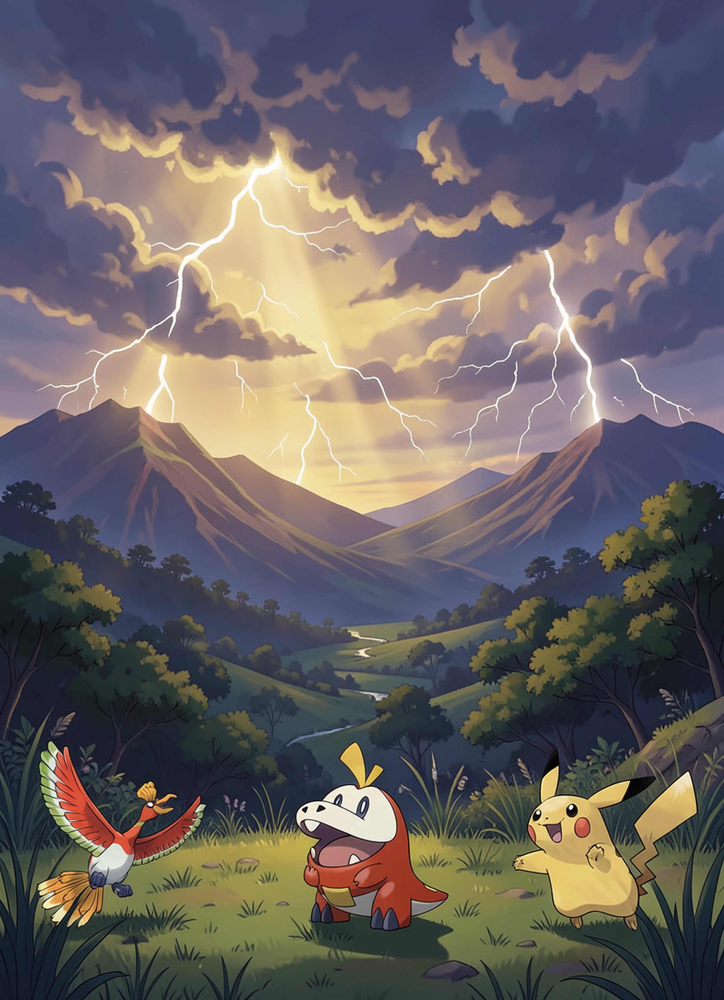

#### P27 – Ho-Oh · unten links

Bisheriger Agentencheck: beanstandet. Deine Bewertung: offen.

| Kartenausschnitt | Quell-Pokémon |
| --- | --- |
|  |  |

[Zuschnitt in Originalauflösung](../../tmp/poster-workspaces/SV08/comfyui_poster/promotion/poster-flux2-cards/card_r3_c1.png) · [Quellbild in Originalauflösung](../../tmp/poster-workspaces/SV08/sources/cutouts/pokemon_250_ho_oh.png)

#### P27 – Krokel · unten Mitte

Bisheriger Agentencheck: bestanden. Deine Bewertung: offen.

| Kartenausschnitt | Quell-Pokémon |
| --- | --- |
|  |  |

[Zuschnitt in Originalauflösung](../../tmp/poster-workspaces/SV08/comfyui_poster/promotion/poster-flux2-cards/card_r3_c2.png) · [Quellbild in Originalauflösung](../../tmp/poster-workspaces/SV08/sources/cutouts/pokemon_909_fuecoco.png)

#### P27 – Pikachu · unten rechts

Bisheriger Agentencheck: unklar. Deine Bewertung: offen.

| Kartenausschnitt | Quell-Pokémon |
| --- | --- |
|  |  |

[Zuschnitt in Originalauflösung](../../tmp/poster-workspaces/SV08/comfyui_poster/promotion/poster-flux2-cards/card_r3_c3.png) · [Quellbild in Originalauflösung](../../tmp/poster-workspaces/SV08/sources/cutouts/pokemon_025_pikachu.png)

[Vorhandene Fassung mit Beschriftung](../../tmp/poster-workspaces/SV08/comfyui_poster/promotion/poster-flux2.png) · [Prüfbericht](2026-09-12-panorama-audit-late-tcg.json) · [Zweitprüfung](2026-09-12-panorama-audit-me05-sv08-second-review.json)

Bildkennung: `d931776dc062cc9f` (vollständiger Hash im zugehörigen JSON-Snapshot).

### P28 – Prismatische Entwicklungen (SV08.5)

**Deine Bewertung: offen.** 2 Figur(en) beanstandet.

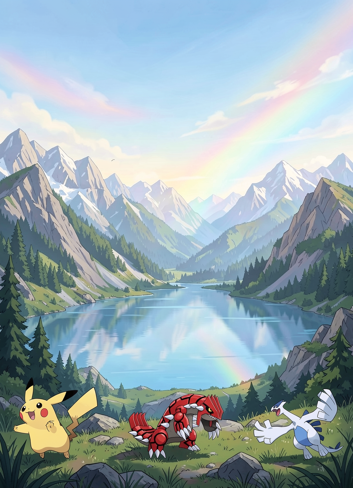

#### P28 – Pikachu · unten links

Bisheriger Agentencheck: bestanden. Deine Bewertung: offen.

| Kartenausschnitt | Quell-Pokémon |
| --- | --- |
|  |  |

[Zuschnitt in Originalauflösung](../../tmp/poster-workspaces/SV08.5/comfyui_poster/promotion/poster-flux2-cards/card_r3_c1.png) · [Quellbild in Originalauflösung](../../tmp/poster-workspaces/SV08.5/sources/cutouts/pokemon_025_pikachu.png)

#### P28 – Groudon · unten Mitte

Bisheriger Agentencheck: beanstandet. Deine Bewertung: offen.

| Kartenausschnitt | Quell-Pokémon |
| --- | --- |
|  |  |

[Zuschnitt in Originalauflösung](../../tmp/poster-workspaces/SV08.5/comfyui_poster/promotion/poster-flux2-cards/card_r3_c2.png) · [Quellbild in Originalauflösung](../../tmp/poster-workspaces/SV08.5/sources/cutouts/pokemon_383_groudon.png)

#### P28 – Lugia · unten rechts

Bisheriger Agentencheck: beanstandet. Deine Bewertung: offen.

| Kartenausschnitt | Quell-Pokémon |
| --- | --- |
|  |  |

[Zuschnitt in Originalauflösung](../../tmp/poster-workspaces/SV08.5/comfyui_poster/promotion/poster-flux2-cards/card_r3_c3.png) · [Quellbild in Originalauflösung](../../tmp/poster-workspaces/SV08.5/sources/cutouts/pokemon_249_lugia.png)

[Vorhandene Fassung mit Beschriftung](../../tmp/poster-workspaces/SV08.5/comfyui_poster/promotion/poster-flux2.png) · [Prüfbericht](2026-09-12-panorama-audit-late-tcg.json)

Bildkennung: `0fa96a8cf36e05d5` (vollständiger Hash im zugehörigen JSON-Snapshot).

### P29 – Reisegefährten (SV09)

**Deine Bewertung: offen.** 2 Figur(en) beanstandet, 1 unklar.

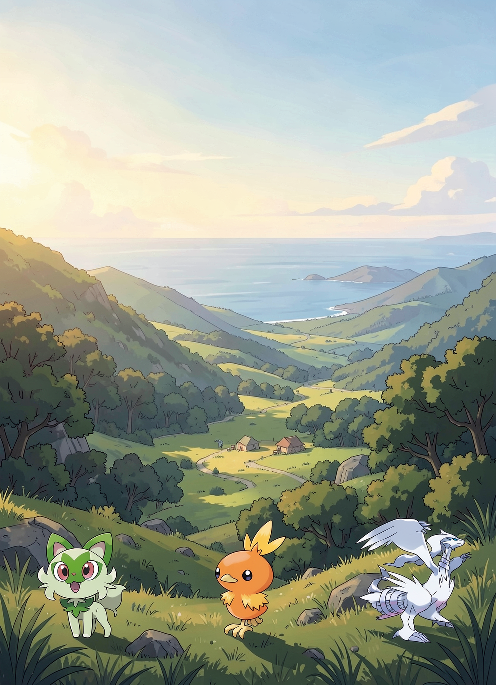

#### P29 – Felori · unten links

Bisheriger Agentencheck: beanstandet. Deine Bewertung: offen.

| Kartenausschnitt | Quell-Pokémon |
| --- | --- |
|  |  |

[Zuschnitt in Originalauflösung](../../tmp/poster-workspaces/SV09/comfyui_poster/promotion/poster-flux2-cards/card_r3_c1.png) · [Quellbild in Originalauflösung](../../tmp/poster-workspaces/SV09/sources/cutouts/pokemon_906_sprigatito.png)

#### P29 – Flemmli · unten Mitte

Bisheriger Agentencheck: unklar. Deine Bewertung: offen.

| Kartenausschnitt | Quell-Pokémon |
| --- | --- |
|  |  |

[Zuschnitt in Originalauflösung](../../tmp/poster-workspaces/SV09/comfyui_poster/promotion/poster-flux2-cards/card_r3_c2.png) · [Quellbild in Originalauflösung](../../tmp/poster-workspaces/SV09/sources/cutouts/pokemon_255_torchic.png)

#### P29 – Reshiram · unten rechts

Bisheriger Agentencheck: beanstandet. Deine Bewertung: offen.

| Kartenausschnitt | Quell-Pokémon |
| --- | --- |
|  |  |

[Zuschnitt in Originalauflösung](../../tmp/poster-workspaces/SV09/comfyui_poster/promotion/poster-flux2-cards/card_r3_c3.png) · [Quellbild in Originalauflösung](../../tmp/poster-workspaces/SV09/sources/cutouts/pokemon_643_reshiram.png)

[Vorhandene Fassung mit Beschriftung](../../tmp/poster-workspaces/SV09/comfyui_poster/promotion/poster-flux2.png) · [Prüfbericht](2026-09-12-panorama-audit-late-tcg.json)

Bildkennung: `fea5eaa24c1d7d1f` (vollständiger Hash im zugehörigen JSON-Snapshot).

### P30 – Ewige Rivalen (SV10)

**Deine Bewertung: offen.** 3 Figur(en) beanstandet.

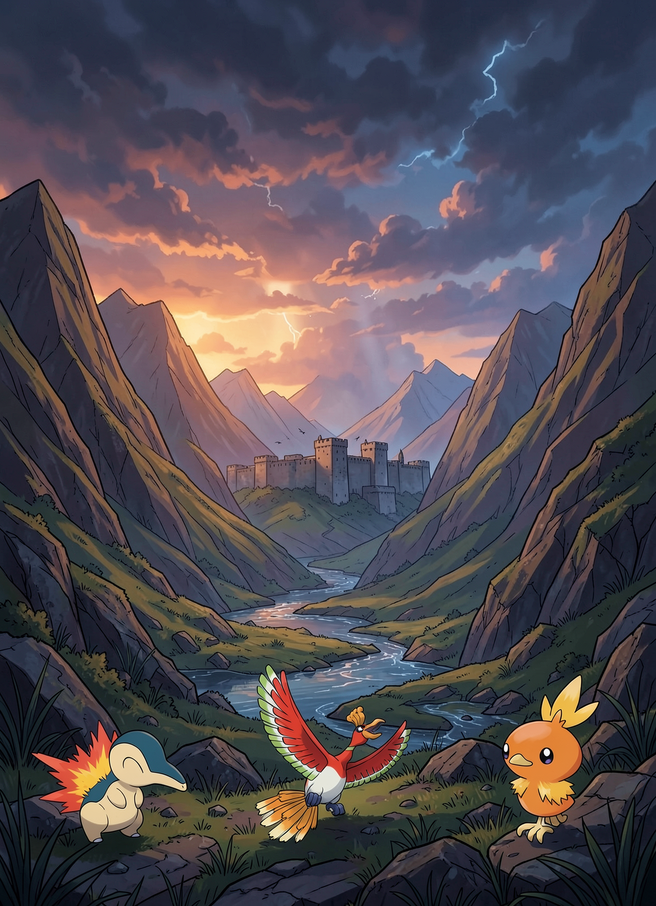

#### P30 – Feurigel · unten links

Bisheriger Agentencheck: beanstandet. Deine Bewertung: offen.

| Kartenausschnitt | Quell-Pokémon |
| --- | --- |
|  |  |

[Zuschnitt in Originalauflösung](../../tmp/poster-workspaces/SV10/comfyui_poster/promotion/poster-flux2-cards/card_r3_c1.png) · [Quellbild in Originalauflösung](../../tmp/poster-workspaces/SV10/sources/cutouts/pokemon_155_cyndaquil.png)

#### P30 – Ho-Oh · unten Mitte

Bisheriger Agentencheck: beanstandet. Deine Bewertung: offen.

| Kartenausschnitt | Quell-Pokémon |
| --- | --- |
|  |  |

[Zuschnitt in Originalauflösung](../../tmp/poster-workspaces/SV10/comfyui_poster/promotion/poster-flux2-cards/card_r3_c2.png) · [Quellbild in Originalauflösung](../../tmp/poster-workspaces/SV10/sources/cutouts/pokemon_250_ho_oh.png)

#### P30 – Flemmli · unten rechts

Bisheriger Agentencheck: beanstandet. Deine Bewertung: offen.

| Kartenausschnitt | Quell-Pokémon |
| --- | --- |
|  |  |

[Zuschnitt in Originalauflösung](../../tmp/poster-workspaces/SV10/comfyui_poster/promotion/poster-flux2-cards/card_r3_c3.png) · [Quellbild in Originalauflösung](../../tmp/poster-workspaces/SV10/sources/cutouts/pokemon_255_torchic.png)

[Vorhandene Fassung mit Beschriftung](../../tmp/poster-workspaces/SV10/comfyui_poster/promotion/poster-flux2.png) · [Prüfbericht](2026-09-12-panorama-audit-late-tcg.json)

Bildkennung: `d58e13869502dc2e` (vollständiger Hash im zugehörigen JSON-Snapshot).

### P31 – Schwarze Blitze (SV10.5B)

**Deine Bewertung: offen.** 2 Figur(en) beanstandet.

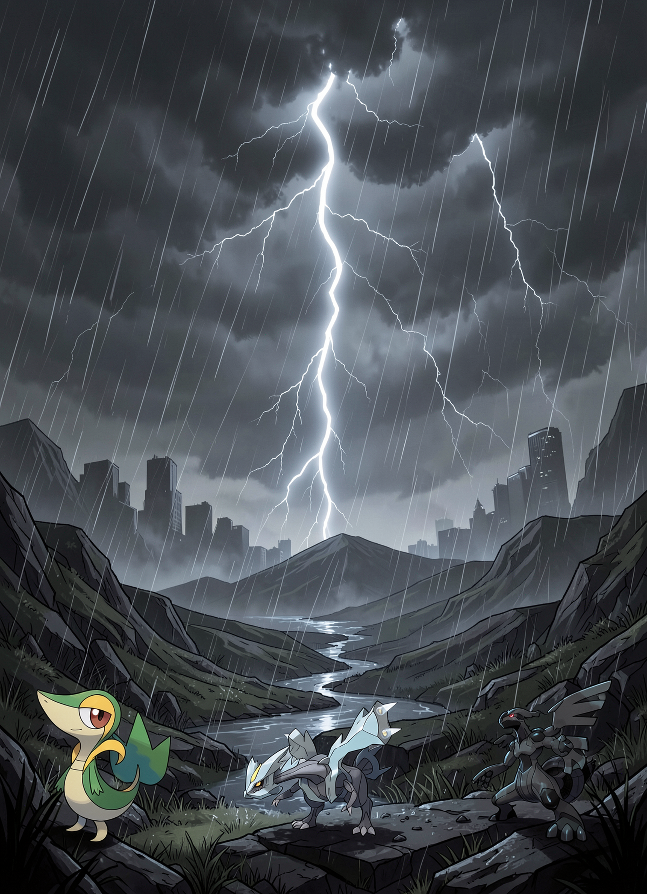

#### P31 – Serpifeu · unten links

Bisheriger Agentencheck: bestanden. Deine Bewertung: offen.

| Kartenausschnitt | Quell-Pokémon |
| --- | --- |
|  |  |

[Zuschnitt in Originalauflösung](../../tmp/poster-workspaces/SV10.5B/comfyui_poster/promotion/poster-flux2-cards/card_r3_c1.png) · [Quellbild in Originalauflösung](../../tmp/poster-workspaces/SV10.5B/sources/cutouts/pokemon_495_snivy.png)

#### P31 – Kyurem · unten Mitte

Bisheriger Agentencheck: beanstandet. Deine Bewertung: offen.

| Kartenausschnitt | Quell-Pokémon |
| --- | --- |
|  |  |

[Zuschnitt in Originalauflösung](../../tmp/poster-workspaces/SV10.5B/comfyui_poster/promotion/poster-flux2-cards/card_r3_c2.png) · [Quellbild in Originalauflösung](../../tmp/poster-workspaces/SV10.5B/sources/cutouts/pokemon_646_kyurem.png)

#### P31 – Zekrom · unten rechts

Bisheriger Agentencheck: beanstandet. Deine Bewertung: offen.

| Kartenausschnitt | Quell-Pokémon |
| --- | --- |
|  |  |

[Zuschnitt in Originalauflösung](../../tmp/poster-workspaces/SV10.5B/comfyui_poster/promotion/poster-flux2-cards/card_r3_c3.png) · [Quellbild in Originalauflösung](../../tmp/poster-workspaces/SV10.5B/sources/cutouts/pokemon_644_zekrom.png)

[Vorhandene Fassung mit Beschriftung](../../tmp/poster-workspaces/SV10.5B/comfyui_poster/promotion/poster-flux2.png) · [Prüfbericht](2026-09-12-panorama-audit-late-tcg.json)

Bildkennung: `802d5dec3ae46e0b` (vollständiger Hash im zugehörigen JSON-Snapshot).

### P32 – Weiße Flammen (SV10.5W)

**Deine Bewertung: offen.** 3 Figur(en) beanstandet.

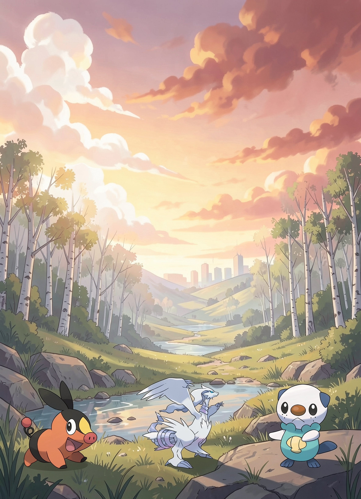

#### P32 – Floink · unten links

Bisheriger Agentencheck: beanstandet. Deine Bewertung: offen.

| Kartenausschnitt | Quell-Pokémon |
| --- | --- |
|  |  |

[Zuschnitt in Originalauflösung](../../tmp/poster-workspaces/SV10.5W/comfyui_poster/promotion/poster-flux2-cards/card_r3_c1.png) · [Quellbild in Originalauflösung](../../tmp/poster-workspaces/SV10.5W/sources/cutouts/pokemon_498_tepig.png)

#### P32 – Reshiram · unten Mitte

Bisheriger Agentencheck: beanstandet. Deine Bewertung: offen.

| Kartenausschnitt | Quell-Pokémon |
| --- | --- |
|  |  |

[Zuschnitt in Originalauflösung](../../tmp/poster-workspaces/SV10.5W/comfyui_poster/promotion/poster-flux2-cards/card_r3_c2.png) · [Quellbild in Originalauflösung](../../tmp/poster-workspaces/SV10.5W/sources/cutouts/pokemon_643_reshiram.png)

#### P32 – Ottaro · unten rechts

Bisheriger Agentencheck: beanstandet. Deine Bewertung: offen.

| Kartenausschnitt | Quell-Pokémon |
| --- | --- |
|  |  |

[Zuschnitt in Originalauflösung](../../tmp/poster-workspaces/SV10.5W/comfyui_poster/promotion/poster-flux2-cards/card_r3_c3.png) · [Quellbild in Originalauflösung](../../tmp/poster-workspaces/SV10.5W/sources/cutouts/pokemon_501_oshawott.png)

[Vorhandene Fassung mit Beschriftung](../../tmp/poster-workspaces/SV10.5W/comfyui_poster/promotion/poster-flux2.png) · [Prüfbericht](2026-09-12-panorama-audit-late-tcg.json)

Bildkennung: `da524b22b59dc765` (vollständiger Hash im zugehörigen JSON-Snapshot).

### P33 – SVP Black Star Promos (SVP)

**Deine Bewertung: offen.** 3 Figur(en) beanstandet.

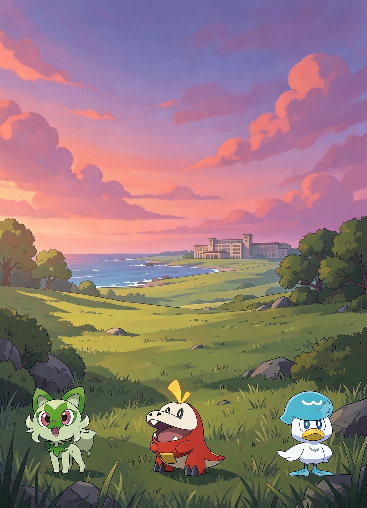

#### P33 – Felori · unten links

Bisheriger Agentencheck: beanstandet. Deine Bewertung: offen.

| Kartenausschnitt | Quell-Pokémon |
| --- | --- |
|  |  |

[Zuschnitt in Originalauflösung](../../tmp/poster-workspaces/SVP/comfyui_poster/promotion/poster-flux2-cards/card_r3_c1.png) · [Quellbild in Originalauflösung](../../tmp/poster-workspaces/SVP/sources/cutouts/pokemon_906_sprigatito.png)

#### P33 – Krokel · unten Mitte

Bisheriger Agentencheck: beanstandet. Deine Bewertung: offen.

| Kartenausschnitt | Quell-Pokémon |
| --- | --- |
|  |  |

[Zuschnitt in Originalauflösung](../../tmp/poster-workspaces/SVP/comfyui_poster/promotion/poster-flux2-cards/card_r3_c2.png) · [Quellbild in Originalauflösung](../../tmp/poster-workspaces/SVP/sources/cutouts/pokemon_909_fuecoco.png)

#### P33 – Kwaks · unten rechts

Bisheriger Agentencheck: beanstandet. Deine Bewertung: offen.

| Kartenausschnitt | Quell-Pokémon |
| --- | --- |
|  |  |

[Zuschnitt in Originalauflösung](../../tmp/poster-workspaces/SVP/comfyui_poster/promotion/poster-flux2-cards/card_r3_c3.png) · [Quellbild in Originalauflösung](../../tmp/poster-workspaces/SVP/sources/cutouts/pokemon_912_quaxly.png)

[Vorhandene Fassung mit Beschriftung](../../tmp/poster-workspaces/SVP/comfyui_poster/promotion/poster-flux2.png) · [Prüfbericht](2026-09-12-panorama-audit-late-tcg.json)

Bildkennung: `6527600191306285` (vollständiger Hash im zugehörigen JSON-Snapshot).

### P34 – Mega-Entwicklung (ME01)

**Deine Bewertung: offen.** 2 Figur(en) beanstandet, 1 unklar.

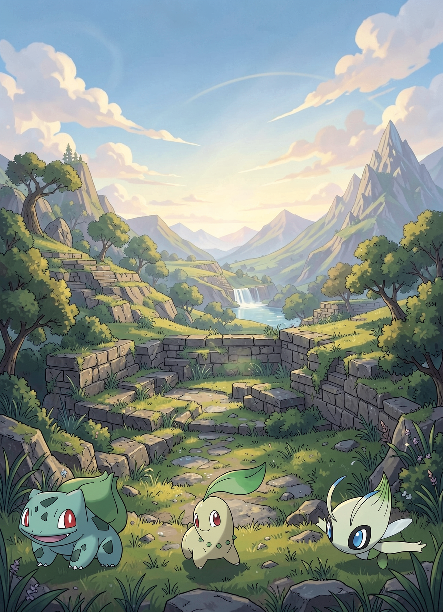

#### P34 – Bisasam · unten links

Bisheriger Agentencheck: beanstandet. Deine Bewertung: offen.

| Kartenausschnitt | Quell-Pokémon |
| --- | --- |
|  |  |

[Zuschnitt in Originalauflösung](../../tmp/poster-workspaces/ME01/comfyui_poster/promotion/poster-flux2-cards/card_r3_c1.png) · [Quellbild in Originalauflösung](../../tmp/poster-workspaces/ME01/sources/cutouts/pokemon_001_bulbasaur.png)

#### P34 – Endivie · unten Mitte

Bisheriger Agentencheck: beanstandet. Deine Bewertung: offen.

| Kartenausschnitt | Quell-Pokémon |
| --- | --- |
|  |  |

[Zuschnitt in Originalauflösung](../../tmp/poster-workspaces/ME01/comfyui_poster/promotion/poster-flux2-cards/card_r3_c2.png) · [Quellbild in Originalauflösung](../../tmp/poster-workspaces/ME01/sources/cutouts/pokemon_152_chikorita.png)

#### P34 – Celebi · unten rechts

Bisheriger Agentencheck: unklar. Deine Bewertung: offen.

| Kartenausschnitt | Quell-Pokémon |
| --- | --- |
|  |  |

[Zuschnitt in Originalauflösung](../../tmp/poster-workspaces/ME01/comfyui_poster/promotion/poster-flux2-cards/card_r3_c3.png) · [Quellbild in Originalauflösung](../../tmp/poster-workspaces/ME01/sources/cutouts/pokemon_251_celebi.png)

[Vorhandene Fassung mit Beschriftung](../../tmp/poster-workspaces/ME01/comfyui_poster/promotion/poster-flux2.png) · [Prüfbericht](2026-09-12-panorama-audit-late-tcg.json)

Bildkennung: `d189aad3bd442ddc` (vollständiger Hash im zugehörigen JSON-Snapshot).

### P35 – Fatale Flammen (ME02)

**Deine Bewertung: offen.** 3 Figur(en) beanstandet.

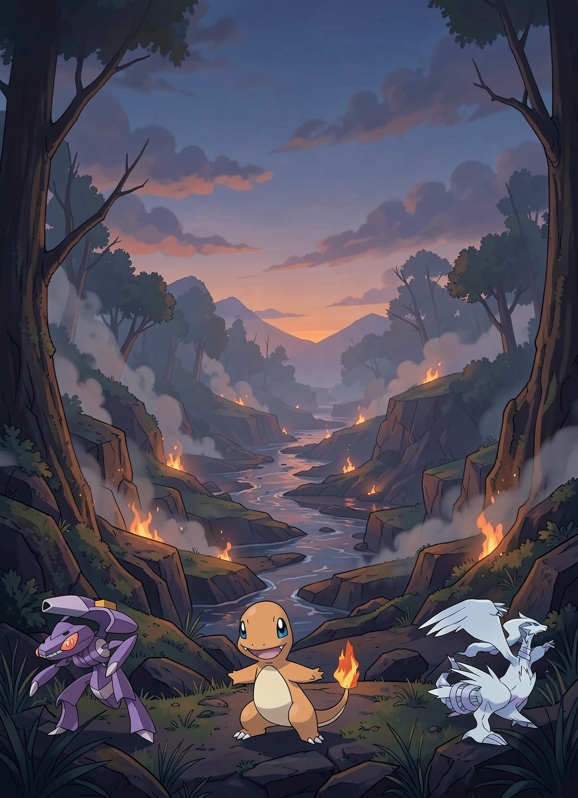

#### P35 – Genesect · unten links

Bisheriger Agentencheck: beanstandet. Deine Bewertung: offen.

| Kartenausschnitt | Quell-Pokémon |
| --- | --- |
|  |  |

[Zuschnitt in Originalauflösung](../../tmp/poster-workspaces/ME02/comfyui_poster/promotion/poster-flux2-cards/card_r3_c1.png) · [Quellbild in Originalauflösung](../../tmp/poster-workspaces/ME02/sources/cutouts/pokemon_649_genesect.png)

#### P35 – Glumanda · unten Mitte

Bisheriger Agentencheck: beanstandet. Deine Bewertung: offen.

| Kartenausschnitt | Quell-Pokémon |
| --- | --- |
|  |  |

[Zuschnitt in Originalauflösung](../../tmp/poster-workspaces/ME02/comfyui_poster/promotion/poster-flux2-cards/card_r3_c2.png) · [Quellbild in Originalauflösung](../../tmp/poster-workspaces/ME02/sources/cutouts/pokemon_004_charmander.png)

#### P35 – Reshiram · unten rechts

Bisheriger Agentencheck: beanstandet. Deine Bewertung: offen.

| Kartenausschnitt | Quell-Pokémon |
| --- | --- |
|  |  |

[Zuschnitt in Originalauflösung](../../tmp/poster-workspaces/ME02/comfyui_poster/promotion/poster-flux2-cards/card_r3_c3.png) · [Quellbild in Originalauflösung](../../tmp/poster-workspaces/ME02/sources/cutouts/pokemon_643_reshiram.png)

[Vorhandene Fassung mit Beschriftung](../../tmp/poster-workspaces/ME02/comfyui_poster/promotion/poster-flux2.png) · [Prüfbericht](2026-09-12-panorama-audit-late-tcg.json)

Bildkennung: `f20acc0f58cc0f21` (vollständiger Hash im zugehörigen JSON-Snapshot).

### P36 – Erhabene Helden (ME02.5)

**Deine Bewertung: offen.** 3 Figur(en) beanstandet.

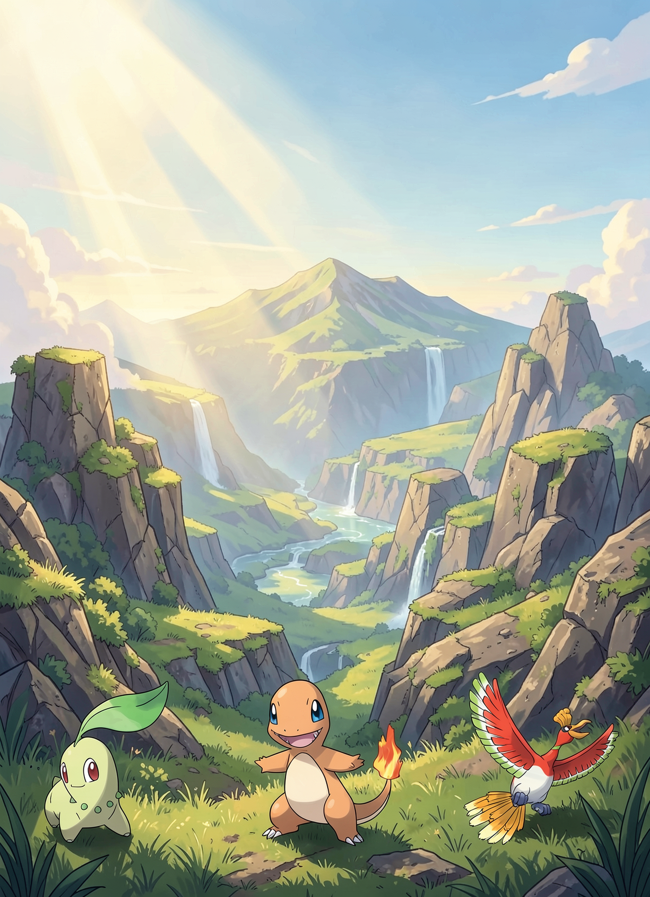

#### P36 – Endivie · unten links

Bisheriger Agentencheck: beanstandet. Deine Bewertung: offen.

| Kartenausschnitt | Quell-Pokémon |
| --- | --- |
|  |  |

[Zuschnitt in Originalauflösung](../../tmp/poster-workspaces/ME02.5/comfyui_poster/promotion/poster-flux2-cards/card_r3_c1.png) · [Quellbild in Originalauflösung](../../tmp/poster-workspaces/ME02.5/sources/cutouts/pokemon_152_chikorita.png)

#### P36 – Glumanda · unten Mitte

Bisheriger Agentencheck: beanstandet. Deine Bewertung: offen.

| Kartenausschnitt | Quell-Pokémon |
| --- | --- |
|  |  |

[Zuschnitt in Originalauflösung](../../tmp/poster-workspaces/ME02.5/comfyui_poster/promotion/poster-flux2-cards/card_r3_c2.png) · [Quellbild in Originalauflösung](../../tmp/poster-workspaces/ME02.5/sources/cutouts/pokemon_004_charmander.png)

#### P36 – Ho-Oh · unten rechts

Bisheriger Agentencheck: beanstandet. Deine Bewertung: offen.

| Kartenausschnitt | Quell-Pokémon |
| --- | --- |
|  |  |

[Zuschnitt in Originalauflösung](../../tmp/poster-workspaces/ME02.5/comfyui_poster/promotion/poster-flux2-cards/card_r3_c3.png) · [Quellbild in Originalauflösung](../../tmp/poster-workspaces/ME02.5/sources/cutouts/pokemon_250_ho_oh.png)

[Vorhandene Fassung mit Beschriftung](../../tmp/poster-workspaces/ME02.5/comfyui_poster/promotion/poster-flux2.png) · [Prüfbericht](2026-09-12-panorama-audit-late-tcg.json)

Bildkennung: `e2f54fb50dca25a9` (vollständiger Hash im zugehörigen JSON-Snapshot).

### P37 – Optimale Ordnung (ME03)

**Deine Bewertung: offen.** 1 Figur(en) beanstandet.

#### P37 – Serpifeu · unten links

Bisheriger Agentencheck: bestanden. Deine Bewertung: offen.

| Kartenausschnitt | Quell-Pokémon |
| --- | --- |
|  |  |

[Zuschnitt in Originalauflösung](../../tmp/poster-workspaces/ME03/comfyui_poster/promotion/poster-flux2-cards/card_r3_c1.png) · [Quellbild in Originalauflösung](../../tmp/poster-workspaces/ME03/sources/cutouts/pokemon_495_snivy.png)

#### P37 – Bauz · unten Mitte

Bisheriger Agentencheck: bestanden. Deine Bewertung: offen.

| Kartenausschnitt | Quell-Pokémon |
| --- | --- |
|  |  |

[Zuschnitt in Originalauflösung](../../tmp/poster-workspaces/ME03/comfyui_poster/promotion/poster-flux2-cards/card_r3_c2.png) · [Quellbild in Originalauflösung](../../tmp/poster-workspaces/ME03/sources/cutouts/pokemon_722_rowlet.png)

#### P37 – Mega-Zygarde · unten rechts

Bisheriger Agentencheck: beanstandet. Deine Bewertung: offen.

| Kartenausschnitt | Quell-Pokémon |
| --- | --- |
|  |  |

[Zuschnitt in Originalauflösung](../../tmp/poster-workspaces/ME03/comfyui_poster/promotion/poster-flux2-cards/card_r3_c3.png) · [Quellbild in Originalauflösung](../../tmp/poster-workspaces/ME03/sources/cutouts/pokemon_718_artwork_10301_mega_zygarde.png)

[Vorhandene Fassung mit Beschriftung](../../tmp/poster-workspaces/ME03/comfyui_poster/promotion/poster-flux2.png) · [Prüfbericht](2026-09-12-panorama-audit-late-tcg.json)

Bildkennung: `f168f308c04d3cfd` (vollständiger Hash im zugehörigen JSON-Snapshot).

### P38 – Wachsendes Chaos (ME04)

**Deine Bewertung: offen.** 3 Figur(en) beanstandet.

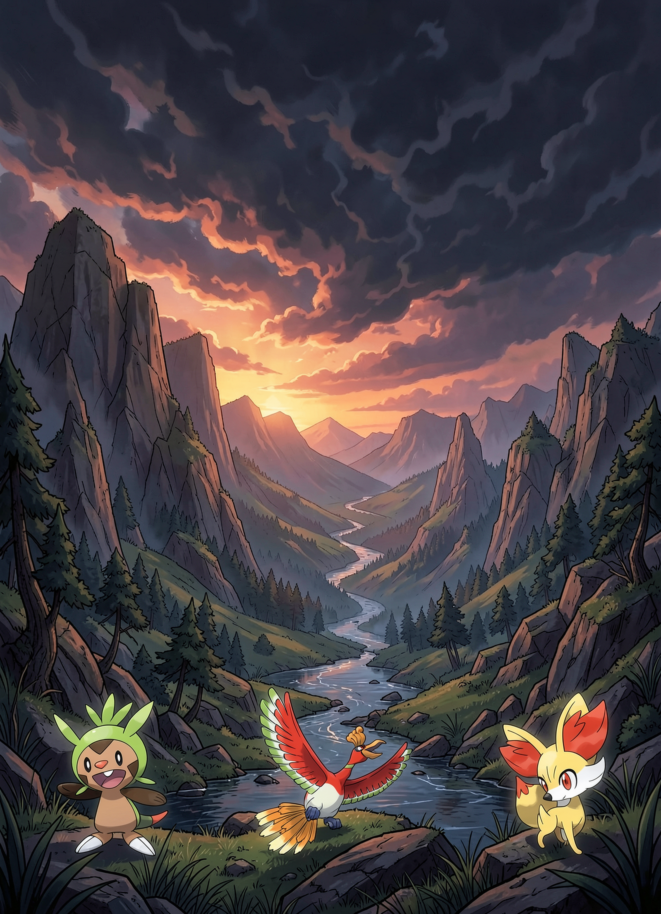

#### P38 – Igamaro · unten links

Bisheriger Agentencheck: beanstandet. Deine Bewertung: offen.

| Kartenausschnitt | Quell-Pokémon |
| --- | --- |
|  |  |

[Zuschnitt in Originalauflösung](../../tmp/poster-workspaces/ME04/comfyui_poster/promotion/poster-flux2-cards/card_r3_c1.png) · [Quellbild in Originalauflösung](../../tmp/poster-workspaces/ME04/sources/cutouts/pokemon_650_chespin.png)

#### P38 – Ho-Oh · unten Mitte

Bisheriger Agentencheck: beanstandet. Deine Bewertung: offen.

| Kartenausschnitt | Quell-Pokémon |
| --- | --- |
|  |  |

[Zuschnitt in Originalauflösung](../../tmp/poster-workspaces/ME04/comfyui_poster/promotion/poster-flux2-cards/card_r3_c2.png) · [Quellbild in Originalauflösung](../../tmp/poster-workspaces/ME04/sources/cutouts/pokemon_250_ho_oh.png)

#### P38 – Fynx · unten rechts

Bisheriger Agentencheck: beanstandet. Deine Bewertung: offen.

| Kartenausschnitt | Quell-Pokémon |
| --- | --- |
|  |  |

[Zuschnitt in Originalauflösung](../../tmp/poster-workspaces/ME04/comfyui_poster/promotion/poster-flux2-cards/card_r3_c3.png) · [Quellbild in Originalauflösung](../../tmp/poster-workspaces/ME04/sources/cutouts/pokemon_653_fennekin.png)

[Vorhandene Fassung mit Beschriftung](../../tmp/poster-workspaces/ME04/comfyui_poster/promotion/poster-flux2.png) · [Prüfbericht](2026-09-12-panorama-audit-late-tcg.json)

Bildkennung: `4206d994cf6cf049` (vollständiger Hash im zugehörigen JSON-Snapshot).

### P39 – MEP Black Star Promos (MEP)

**Deine Bewertung: offen.** 3 Figur(en) beanstandet.

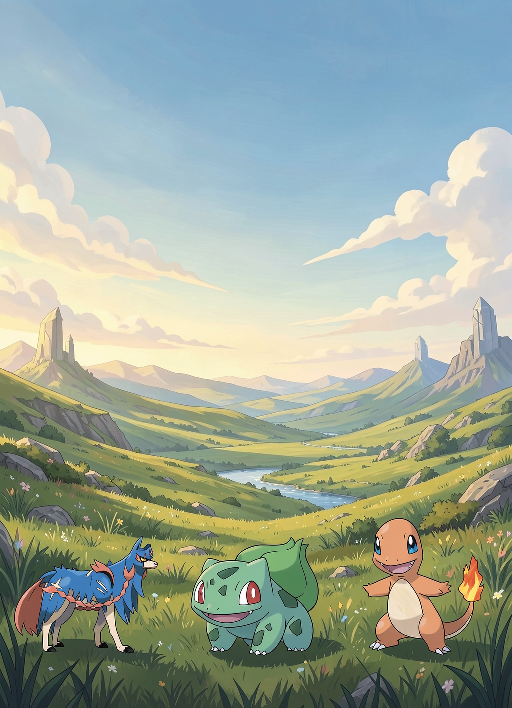

#### P39 – Zacian · unten links

Bisheriger Agentencheck: beanstandet. Deine Bewertung: offen.

| Kartenausschnitt | Quell-Pokémon |
| --- | --- |
|  |  |

[Zuschnitt in Originalauflösung](../../tmp/poster-workspaces/MEP/comfyui_poster/promotion/poster-flux2-cards/card_r3_c1.png) · [Quellbild in Originalauflösung](../../tmp/poster-workspaces/MEP/sources/cutouts/pokemon_888_zacian.png)

#### P39 – Bisasam · unten Mitte

Bisheriger Agentencheck: beanstandet. Deine Bewertung: offen.

| Kartenausschnitt | Quell-Pokémon |
| --- | --- |
|  |  |

[Zuschnitt in Originalauflösung](../../tmp/poster-workspaces/MEP/comfyui_poster/promotion/poster-flux2-cards/card_r3_c2.png) · [Quellbild in Originalauflösung](../../tmp/poster-workspaces/MEP/sources/cutouts/pokemon_001_bulbasaur.png)

#### P39 – Glumanda · unten rechts

Bisheriger Agentencheck: beanstandet. Deine Bewertung: offen.

| Kartenausschnitt | Quell-Pokémon |
| --- | --- |
|  |  |

[Zuschnitt in Originalauflösung](../../tmp/poster-workspaces/MEP/comfyui_poster/promotion/poster-flux2-cards/card_r3_c3.png) · [Quellbild in Originalauflösung](../../tmp/poster-workspaces/MEP/sources/cutouts/pokemon_004_charmander.png)

[Vorhandene Fassung mit Beschriftung](../../tmp/poster-workspaces/MEP/comfyui_poster/promotion/poster-flux2.png) · [Prüfbericht](2026-09-12-panorama-audit-late-tcg.json)

Bildkennung: `25bf253bd104c6f6` (vollständiger Hash im zugehörigen JSON-Snapshot).

### P40 – Pokémon ex (ExGen3/sections/normal)

**Deine Bewertung: offen.** 2 Figur(en) beanstandet, 1 unklar.

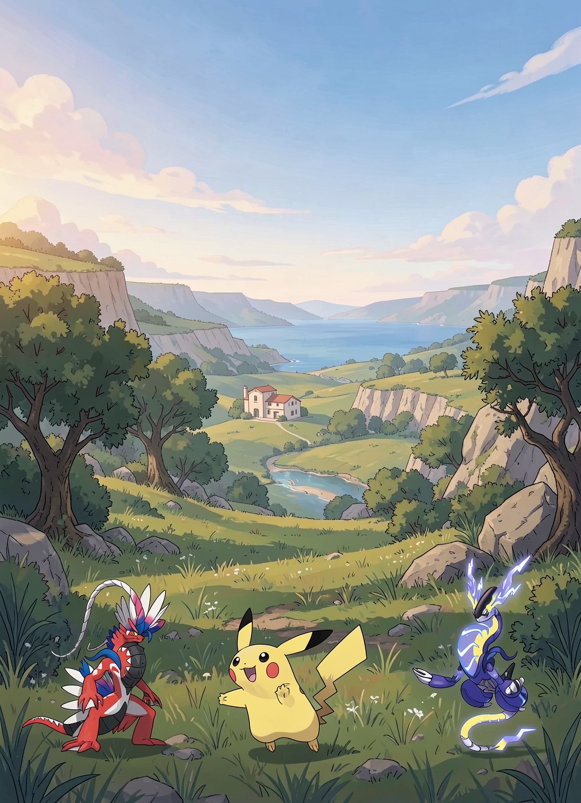

#### P40 – Koraidon · unten links

Bisheriger Agentencheck: beanstandet. Deine Bewertung: offen.

| Kartenausschnitt | Quell-Pokémon |
| --- | --- |
|  |  |

[Zuschnitt in Originalauflösung](../../tmp/poster-workspaces/ExGen3/sections/normal/comfyui_poster/promotion/poster-flux2-cards/card_r3_c1.png) · [Quellbild in Originalauflösung](../../tmp/poster-workspaces/ExGen3/sections/normal/sources/cutouts/pokemon_1007_koraidon.png)

#### P40 – Pikachu · unten Mitte

Bisheriger Agentencheck: unklar. Deine Bewertung: offen.

| Kartenausschnitt | Quell-Pokémon |
| --- | --- |
|  |  |

[Zuschnitt in Originalauflösung](../../tmp/poster-workspaces/ExGen3/sections/normal/comfyui_poster/promotion/poster-flux2-cards/card_r3_c2.png) · [Quellbild in Originalauflösung](../../tmp/poster-workspaces/ExGen3/sections/normal/sources/cutouts/pokemon_025_pikachu.png)

#### P40 – Miraidon · unten rechts

Bisheriger Agentencheck: beanstandet. Deine Bewertung: offen.

| Kartenausschnitt | Quell-Pokémon |
| --- | --- |
|  |  |

[Zuschnitt in Originalauflösung](../../tmp/poster-workspaces/ExGen3/sections/normal/comfyui_poster/promotion/poster-flux2-cards/card_r3_c3.png) · [Quellbild in Originalauflösung](../../tmp/poster-workspaces/ExGen3/sections/normal/sources/cutouts/pokemon_1008_miraidon.png)

[Prüfbericht](2026-09-12-panorama-audit-exgen3.json)

Bildkennung: `30b426a3806f98d8` (vollständiger Hash im zugehörigen JSON-Snapshot).

## Abgleich dieses Snapshots

Die Dateihashes wurden beim Erstellen gegen die bisherigen Prüfbelege abgeglichen: 40 offene Master, 119 zugehörige Quellen und 360 physische Ausschnitte. Insgesamt 554 Dateien geprüft, einschließlich Berichten, vorhandenen Vorschauen und akzeptierten Kandidaten. Das ist ein Identitäts-/Vollständigkeitsabgleich und keine neue vollständige Sichtprüfung aller Motive.

Die ursprüngliche Zusammenstellung dieser Reviewrunde änderte keine Bilder. Anschließend wurden auf Nutzerwunsch fünf isolierte Nacharbeitsvarianten für P02 erzeugt; keine wurde übernommen. Die fünfte, konturgeführte Fassung E ist für Pikachu und die zwei korrigierten Vordergrundhalme vom Nutzer visuell akzeptiert. Diese Teilfreigabe ist an die gezeigten Dateien gebunden; sie ersetzt nicht die historische Bewertung der unveränderten Bestandsfassung. Originalbilder, PDFs und Release-Archive blieben unverändert. Relaxo, Evoli, die vollständige Panorama-Freigabe, technische Übernahme und Release-Prüfung bleiben offen.
